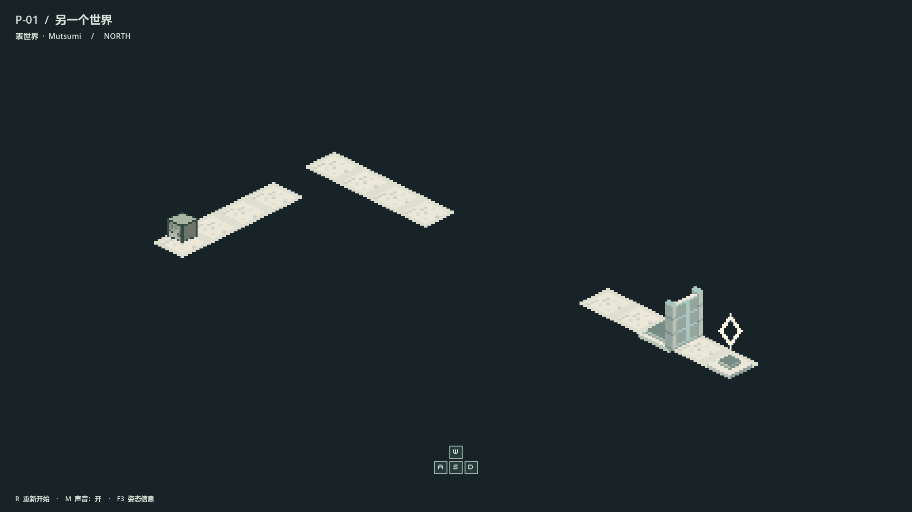
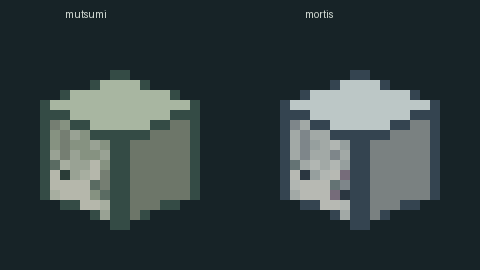
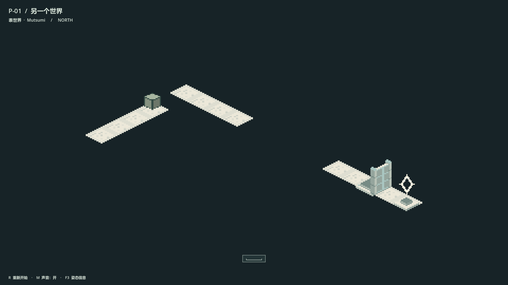
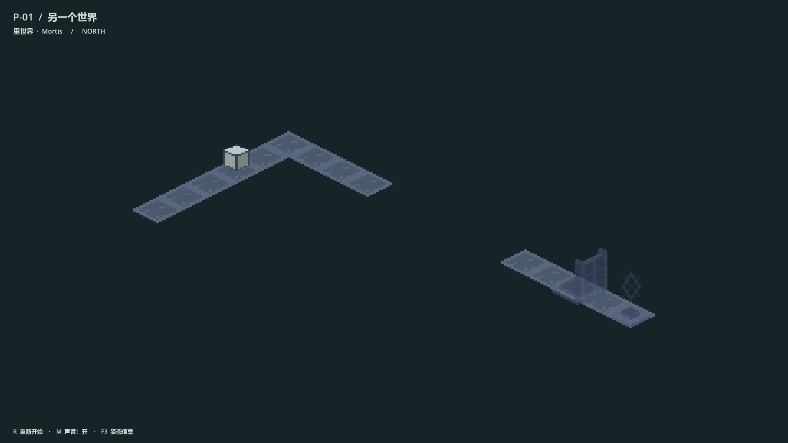
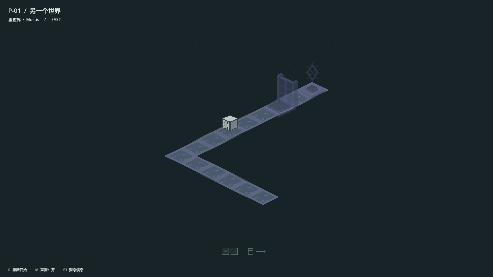
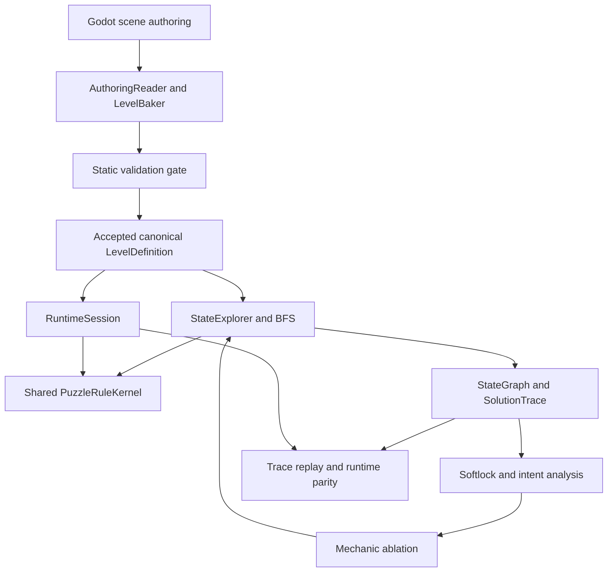

# Mutsumi Veilshift

### 《方块少女：若叶睦》

> A dual-world spatial puzzle game built with Godot, centered on cube rolling, world shifting, perspective connections, and spatial puzzle mechanics.

一个以若叶睦为主题，围绕方块翻滚、表里世界切换、透视连接与空间机关展开的等距视角独立解谜游戏。



**Godot 4.7 · GDScript · Playable prototype**

[Gameplay](#gameplay) · [Screenshots](#screenshots) · [Roadmap](#development-roadmap) · [Getting Started](#getting-started)

> **Repository status**
>
> `main` contains the stable P-01 playable snapshot.
> FOUNDATION-0 through FOUNDATION-3 are integrated on `feat/foundation-core`,
> not on `main`. Authoring/editor tooling is in architecture design, not implementation.
>
> 当前主分支保留 P-01 可玩版本；最新底层架构位于 `feat/foundation-core`，尚未整体并入 main。

## About

Mutsumi Veilshift is a Godot spatial puzzle project with a pixel-art, isometric
visual direction. The protagonist moves as a rolling cube: every step changes
which physical face points where, while the world offers routes that depend on
more than position alone.

The first character theme is **Wakaba Mutsumi / 若叶睦**, with an Inner World
presentation associated with **Mortis**. Surface and Inner give the same puzzle
space different paths, colors, and atmosphere, without requiring knowledge of
the original story.

The current playable level explores a small set of rules through movement,
world shifting, perspective connections, and mechanisms. In parallel, a reusable
puzzle foundation is being developed for future levels and more varied spatial rules.

### Character Presentation

<p align="center">
  
</p>

*In-game pixel representations of Wakaba Mutsumi and Mortis.*
This is an animation preview of the project's production sprites, not a gameplay
capture or concept scene. The sprite workflow uses AI-assisted texture drafts,
followed by pixel normalization and orientation-based frame generation.

## Gameplay

### Cube Rolling

The character rolls between grid cells rather than sliding along the floor.
Its physical face orientation persists across moves, world shifts, and view changes.
Changing your viewpoint does not reset the cube's pose.

### Dual Worlds

Surface and Inner have different walkable layouts.
In P-01, shifting keeps your grid position and succeeds when the destination world
supports that position. The foundation extends this into explicit face-based spatial
mapping and rule checks for future puzzles.

### Perspective Connection

Rotate between four viewing directions to explore how separated spaces line up.
An authored connection becomes traversable when its world and view conditions match.
Visual alignment alone does not create arbitrary new paths.

P-01 uses a deliberately constructed 2D projection; it is not a general-purpose
3D optical-illusion solver.

### Spatial Puzzle Mechanics

**Currently playable in P-01:** world-dependent paths and a bridge, an authored
Perspective Connection, a pressure plate, a door, and an exit with world conditions.

**Supported by the puzzle foundation on the development branch:** face transitions,
discrete world and local-group rotations, celestial-slot changes, logical illumination
and occlusion, mechanism authorization, and validated state transitions.
These additional capabilities are exercised in foundation fixtures and tests;
they are not all present in the playable P-01 level.

## Screenshots

The images below are direct captures of the real P-01 runtime on `main`.
They contain the game's normal interface, with the debug overlay disabled.
No generated gameplay mockups or official animation images are used.

### Surface / Inner

<p align="center">
  
  
</p>

The same position, two world states: these captures show the result of a world shift.

### Perspective Connection



A different view changes how the authored puzzle space connects.

### Current Playable Demo

**P-01 —《另一个世界》 / Another World**

The first complete playable puzzle prototype brings together:

- Cube rolling and persistent orientation.
- Surface / Inner traversal and a Perspective Connection.
- Contextual tutorial prompts and mechanism interactions.
- Exit and completion presentation.
- Audio feedback, transitions, and basic visual polish.

P-01 is a focused demonstration of readable rule combinations.
The complete solution is intentionally left for players to discover.

## Controls

| Input | Action |
| --- | --- |
| WASD / Arrow keys | Roll in screen-relative directions; hold to continue |
| Space | Shift between Surface and Inner |
| Q / E | Rotate the view left / right by 90 degrees |
| Left mouse button + horizontal drag | Rotate the view |
| R | Reset the level |
| M | Toggle master audio mute |

Movement and transition states determine when a new action can begin.
Developer tools are separate: **F3** toggles state debugging; **F4** toggles major
local visual effects for comparison. Neither is required to play.

## Current Development Status

| Stage | Status | Location / scope |
| --- | --- | --- |
| P-01 Playable Prototype | Complete prototype | `main`: first full puzzle, tutorial, completion, basic polish |
| FOUNDATION-0 | Complete | `feat/foundation-core`: architecture and shared contracts |
| FOUNDATION-1 | Complete | `feat/foundation-core`: orientation math, spatial data, state identity |
| FOUNDATION-2 | Complete | `feat/foundation-core`: baker, validator, safety, rule kernel, runtime |
| FOUNDATION-3 | Complete | `feat/foundation-core`: BFS, softlock analysis, intent/ablation, runtime parity |
| FOUNDATION-4 | Architecture design | Authoring/editor workflow; implementation has not started |
| P-02 | Planned | Next production puzzle level; not included in the playable snapshot |

FOUNDATION-4 currently has working design notes, not a completed implementation or
frozen editor specification. Completed milestones refer to their accepted scope,
not a finished game or every future mechanic.

## Development Roadmap

The order below describes development priorities, **not promised release dates**.

| Phase | Status | Goal |
| --- | --- | --- |
| 1 — Playable Prototype | Completed | P-01: movement, traversal, puzzle interactions, tutorial, completion |
| 2 — Puzzle Foundation | Completed on development branch | FOUNDATION-0–3: reusable rules, validation, runtime, solver, quality analysis |
| 3 — Authoring Tooling | Current design work | FOUNDATION-4: Godot authoring and an integrated editor workflow |
| 4 — New Level Production | Next | P-02 first, then additional puzzles and character-themed content |
| 5 — Visual / Audio Production | Longer-term direction | Environment and character polish, audio refinement, possible reward presentation |

### Current: Authoring / Editor Tooling

The design direction combines **Scene** spatial authoring with **Resource** semantic
configuration, while canonical `LevelDefinition` remains the runtime rule definition.

The intended workflow is:

**Scene → Bake → Validate → Solve → Analyze → Preview → Level Acceptance**

Editor inspection, diagnostics, runtime preview, and streamlined acceptance are
workflow goals. The baker already validates outputs in the foundation; a complete
editor interface for orchestrating these steps has not been implemented.

The aim is to spend future level-development effort on map layout and puzzle design,
while reusing the established rules and verification tools.

### Next: Level Production and Presentation

P-02 is planned as the first puzzle combining familiar world-shift, rotation, and
Perspective Connection rules. Additional levels follow as the authoring workflow matures.
Longer-term presentation ideas, including Live2D rewards, remain future possibilities;
they are not included assets or implemented features of this snapshot.

## Technical Highlights

The following foundation capabilities exist on **`feat/foundation-core`**.
They should not be mistaken for modules already shipped in `main`.

| Area | What it provides |
| --- | --- |
| 24-state Cube Orientation | Exact legal cube rotations with stable orientation identities |
| Dual-world Shared Space | Explicit face anchors, surface frames, normals, and validated mapping |
| PuzzleRuleKernel | Shared semantic action evaluation and complete, atomic state transitions |
| Deterministic Level Baker | Authored scene data converted into canonical level definitions |
| Static Validator / Safety | Structural checks and fail-closed transition safety |
| StateExplorer / BFS | One FIFO exploration path with full `StateKey` state identity |
| Softlock Analysis | Reverse reachability over the explored graph |
| PuzzleIntent / Mechanic Ablation | Trace milestone checks and re-solving with selected mechanic edges removed |
| SolutionTrace / RuntimeParity | Replay solver actions through the real foundation runtime and compare full states |

Runtime and search share the same rule kernel instead of maintaining separate puzzle
semantics. Global transitions commit authoritative state through completion handling.

Analysis is deliberately scoped: reaching a search budget does not prove a puzzle
unsolvable; definitive softlock results require a complete graph. Current milestone
analysis concerns a single solution trace, not every possible solution.

## Architecture

**Development-branch architecture:** this diagram describes FOUNDATION,
not the current P-01 implementation on `main`.



## Project Structure

The important directories currently present on **`main`** are:

```text
game/        P-01 level, player, input, and presentation code
prototype/   Earlier systems reused by the playable prototype
production/  Sprite, tileset, mechanism, and other production resources
tests/       Gameplay, asset, and graphical validation
docs/        Design notes, development records, and README images
project.godot
```

The `foundation/` directory belongs to the foundation development branch and is
intentionally absent from this main-branch snapshot.

## Getting Started

1. Clone this repository and check out **`main`** for the playable P-01 snapshot.
2. Import `project.godot` into **Godot 4.7.2** and allow asset imports to finish.
3. Use Godot's **Run Project** action to launch the configured main scene.
4. Explore P-01 with the controls above.

Configured scene: `game/levels/mutsumi/p01_another_world.tscn`.

The project declares Godot **4.7 / Forward Plus** features. The screenshots were
captured with **Godot 4.7.2 on Windows / D3D12**. Other platforms have not been
established as supported by this capture and verification work.
No minimum GPU model or release-build download is implied.

## Verification

The formal FOUNDATION-3 integration report dated **2026-09-16**, present on
`feat/foundation-core`, records:

| Recorded result | Outcome |
| --- | --- |
| Final assertion executions across integration and regression runs | **95,034 checks, 0 failures** |
| Legacy graphical regression | **83 / 83 PASS** |

These are development verification checks, **not 95,034 unique unit tests**, a
coverage percentage, or a live CI status. They describe the integrated foundation
branch and associated regression runs, not foundation code present in `main`.

This documentation update does not claim to rerun the complete foundation suites.
Its checks cover README structure, relative links, images, Mermaid rendering,
and the restricted documentation-only diff.

## Development Branches

| Branch | Purpose |
| --- | --- |
| `main` | Stable P-01 playable snapshot and this public project overview |
| `feat/foundation-core` | Integrated FOUNDATION-0–3 development baseline |
| `docs/foundation-4-authoring-design` | Local architecture discussion for the next tooling stage; working notes are not yet published |

Check out `feat/foundation-core` to inspect the implemented foundation modules
and their formal development records. Integration into `main` is a separate
milestone decision; this README update does not merge the branches.

For the playable snapshot, start with the [P-01 implementation](game/levels/mutsumi/)
and the [gameplay tests](tests/gameplay/).

## Fan Project Disclaimer

Mutsumi Veilshift is an **unofficial fan-made project**.
Wakaba Mutsumi, Mortis, MyGO!!!!!, Ave Mujica, BanG Dream!, and related characters
or trademarks belong to their respective rights holders.
This project is not affiliated with or endorsed by the official rights holders.

## License

Source-code licensing is currently being prepared.
No repository-wide `LICENSE` file is currently provided.

Character-related intellectual property and third-party materials are not covered
by any future source-code license unless explicitly stated. The gameplay images
show this project's runtime; their inclusion does not claim ownership of the
underlying character IP or blanket permission to reuse all assets.
