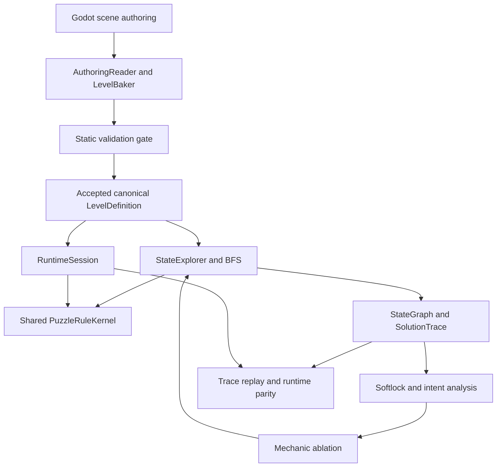

# Mutsumi Veilshift

> A dual-world spatial puzzle game built with Godot, centered on cube rolling, world shifting, and perspective-based connections.

一个以若叶睦为主题，围绕方块翻滚、表里世界切换与空间机关展开的 Godot 独立解谜游戏。

**Engine:** Godot 4.7 · **Language:** GDScript · **Status:** Playable prototype + integrated puzzle foundation

[Play the prototype](#getting-started) · [Gameplay](#core-gameplay) · [Architecture](#technical-highlights) · [Development](#development-status)

## About

Mutsumi Veilshift is the public-facing project name for 方块少女 / Block Girl.
Its first character theme draws on Wakaba Mutsumi and Mortis, expressed through a
rolling cube character and a restrained pixel-art, isometric visual direction.

Surface and Inner offer different routes through a shared puzzle space.
Moving changes the cube's physical orientation; shifting worlds changes which
routes are available; changing the view can reveal an authored Perspective Connection.
Pressure plates, doors, and the exit turn those observations into a playable puzzle.

The repository includes P-01, a complete playable puzzle prototype, alongside a
separate FOUNDATION stack for reusable spatial rules, level validation, solving,
and quality analysis. These are distinct development tracks: the current playable
level does not yet expose every capability implemented in FOUNDATION.

## Core Gameplay

### In the playable P-01 prototype

- **Cube rolling:** grid movement with persistent physical face orientation.
- **Dual worlds:** switch between Surface and Inner at the same grid position when the destination permits it.
- **Four viewing directions:** rotate between NORTH, EAST, SOUTH, and WEST.
- **Perspective Connection:** cross an explicitly authored connection when its world and view conditions are satisfied.
- **Puzzle mechanisms:** interact with a pressure plate and door, then reach an eligible exit.
- **Guided introduction:** contextual controls, action feedback, reset, and a completion flow.

P-01's view changes reconstruct the 2D presentation; they are not a general-purpose
3D camera illusion solver. A visible alignment alone does not create a traversable edge.

### Supported by FOUNDATION

The foundation supports face-based spatial mapping, discrete world and local-group
rotations, celestial-slot changes, logical illumination and occlusion, mechanism
rules, and validated state transitions. These capabilities are exercised through
foundation fixtures and tests; they are not all featured in P-01.

## Controls

Controls below apply to the configured P-01 scene.

| Input | Action |
| --- | --- |
| WASD / Arrow keys | Roll in screen-relative directions; hold to continue moving |
| Space | Shift between Surface and Inner |
| Q / E | Rotate the view left / right by 90 degrees |
| Left mouse button + horizontal drag | Rotate the view |
| R | Reset the level |
| M | Toggle master audio mute |

Rotation and shifting respect the current movement/transition state.

### Developer Controls

| Input | Action |
| --- | --- |
| F3 | Toggle the gameplay debug display |
| F4 | Toggle major local visual effects for comparison/debugging |

## Current Playable Demo

**P-01 — 另一个世界 / Another World**

The first puzzle introduces rolling movement, dual-world traversal, a
perspective-based spatial connection, and mechanism interaction in one level.
Contextual guidance, animation, sound feedback, and the completion presentation
support the full play-through from spawn to exit.

The demo is a focused prototype for testing readability and rule combinations.
Its route and solution are intentionally omitted here.

## Screenshots

Screenshots will be added as the visual presentation is finalized.

## Technical Highlights

### Cube Orientation

The discrete orientation module represents the **24 legal cube orientations**
with exact rotations and a stable orientation ID order.
P-01 also preserves the cube's physical face state across world shifts and view
changes; changing the viewpoint does not reset the character's pose.

### Shared-Space Dual World

FOUNDATION separates level definitions from changing puzzle state.
Face anchors, surface frames, and face normals provide explicit spatial identities
for mapping between worlds. Geometric candidates are validated before they can
become legal transitions.

### Puzzle Rule Kernel

A shared rule kernel evaluates semantic actions and produces complete, atomic
state transitions. Both the foundation runtime and state exploration use this
rule owner, keeping search behavior aligned with runtime behavior.
Global transitions use completion handling before authoritative state is committed.

### Level Baking

Godot scene authoring is read into explicit data and baked into a canonical
`LevelDefinition`. The baker requires validation before accepting an output;
malformed definitions are not silently turned into playable levels.

This is an implemented authoring/baking prototype. A polished editor workflow
remains a future development stage.

### Automated Solver and Puzzle Quality

- **StateExplorer + BFS:** one FIFO exploration path with full `StateKey` identities.
- **StateGraph + SolutionTrace:** reusable search results and semantic action traces.
- **Softlock analysis:** reverse reachability over an explored graph.
- **PuzzleIntent:** evaluate authored milestones against a solution trace.
- **Mechanic ablation:** remove selected mechanic-dependent edges and solve again.
- **Runtime parity:** replay solver traces through the foundation runtime and compare full states.

Analysis has explicit limits: an exhausted search budget is not proof that a puzzle
is unsolvable. Definitive softlock conclusions require a complete graph, and current
milestone analysis is scoped to a single trace rather than every possible solution.

### Architecture

The diagram describes the FOUNDATION pipeline, separate from the existing P-01 implementation.



## Development Status

| Stage | Status | Scope |
| --- | --- | --- |
| P-01 | Playable prototype | Movement, world shift, perspective connection, mechanisms, tutorial, polish |
| FOUNDATION-0 | Complete | Architecture and shared contracts |
| FOUNDATION-1 | Complete | Orientation math, spatial data, celestial queries, state identity |
| FOUNDATION-2 | Complete | Baker, validator, safety, rule kernel, runtime prototype |
| FOUNDATION-3 | Complete | BFS solver, softlock analysis, intent/ablation, runtime parity |
| FOUNDATION-4 | Planned | Authoring / editor tooling |

“Complete” describes the integrated scope of each foundation milestone, not a
finished commercial game or an implementation of every planned puzzle feature.

## Current Focus

The next intended direction is Godot level authoring and editor tooling:

**Scene → Bake → Validate → Solve → Analyze → Preview**

The goal is to make future level development focus on map layout and puzzle design
while reusing the established gameplay infrastructure. Existing bake, validation,
solver, and analysis components provide the base; an integrated editor experience
is still planned. P-02 is future level work, not the current playable demo.

## Project Structure

```text
foundation/  Shared data, spatial rules, runtime, solver, and quality analysis
game/        P-01 gameplay, player, level, and presentation code
prototype/   Earlier prototype systems reused by the playable level
production/  Sprite, tileset, and mechanism asset production resources
tests/       Foundation, gameplay, integration, and graphical regressions
tools/       Authoring/baking and development utilities
docs/        Design contracts, implementation plans, and development records
project.godot
```

## Requirements

- **Godot 4.7.2** is the version used by the recorded integration verification.
- The project declares Godot **4.7 / Forward Plus** features.
- The recorded graphical validation used **Windows with D3D12**; other platforms
  have not been established as supported by that verification.

The test machine's hardware is not a published minimum system requirement.

## Getting Started

1. Clone this repository and check out the branch containing this README.
2. Import `project.godot` into Godot 4.7.2 and allow asset imports to finish.
3. Run the project using Godot's **Run Project** action.
4. The configured main scene opens P-01: `game/levels/mutsumi/p01_another_world.tscn`.

Use the controls above to explore the puzzle. This workflow runs the source project;
it does not require a published release build.

## Verification

The formal FOUNDATION-3 integration report dated **2026-09-16**, included in the
core branch, records:

| Recorded result | Outcome |
| --- | --- |
| Final counted assertion executions across integration and regression runs | **95,034 checks, 0 failures** |
| Legacy graphical regression | **83 / 83 PASS** |

These are recorded test-run results, not unique test-case counts, coverage figures,
or a live CI badge. They include the broader foundation and regression checks.
A README-only update does not constitute a fresh run of the gameplay suites.

The repository contains foundation unit tests, integration tests, graphical runtime
regressions, solver validation, and trace-to-runtime parity tests. Test wrappers may
require local tool configuration; inspect them before running on another machine.

## Documentation

- [Core contracts](docs/superpowers/specs/2026-09-13-foundation-core-contracts.md) — frozen data and spatial interfaces; stage labels reflect the original design freeze.
- [Foundation implementation](foundation/) — the current rule, runtime, solver, and analysis modules.
- [Foundation tests](tests/foundation/) — executable examples and regression coverage for those modules.

Design documents preserve their historical scope. Current implementation and the
milestone table above should be read separately from early “implementation pending” notes.

## Fan Project Disclaimer

This is an **unofficial fan project** inspired by Wakaba Mutsumi and related
MyGO!!!!! / Ave Mujica characters and works, including Mortis.
All related characters and original intellectual property belong to their respective
rights holders. This project is not affiliated with or endorsed by those rights holders.

## License and Assets

License information will be clarified before the first public release.
No repository-wide `LICENSE` file is currently provided.

Character-related assets must not be assumed to be covered by any future source-code
license. Asset provenance and permissions need to be considered individually; this
repository does not claim that all included assets are open source.
A dedicated asset inventory and licensing clarification are planned documentation work.
