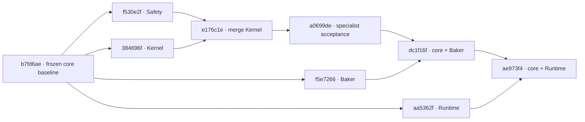

# FOUNDATION-2 — Full Integration Review

2026-09-13 · `feat/foundation-core` · `E:/godot/若叶睦/方块少女-若叶睦`

```text
FOUNDATION_RULE_RUNTIME_PASS
CONTRACT_MISMATCH: NONE
```

All required production-chain and regression gates pass. Final counted assertions: **91,219**, comprising 83,836 FOUNDATION assertions and 7,383 existing-system assertions; zero failures. Counts describe executed assertions, not unique test cases.

## 1. Baseline, sources and actual history

All five required acceptance reports existed with CONTRACT_MISMATCH: NONE. 2A final acceptance comes from the previously accepted Kernel × Safety integration, while its original source report remains provisional. 2D's prerequisite PASS explicitly covers the contract-double prototype; this review adds real production acceptance.

Core was clean at `b7fd6ae9cfa1961a4ca52bb977d66e87903fcec5`. C/D initially contained uncommitted accepted implementations; fresh source validation passed before their GitHub Desktop commits and pushes. No evidence or temporary files were committed.

| Source | Full commit | Commit message |
| --- | --- | --- |
| 2B Static Validator / Safety | `f530e2fe16c64880812b1b20a06504798a477b6b` | `feat: add foundation static validator and safety` |
| 2A Kernel | `384696f3708504d806c630b7e57a898139780695` | `feat: add puzzle rule kernel foundation` |
| Accepted Kernel × Safety | `a0699debe42cf880d25ddda57d46c123bc912b4c` | `test: verify puzzle kernel safety integration` |
| 2C Baker | `f5e72665f8f099f5103a49b9de58b72e45c90c66` | `feat: add foundation level baker` |
| 2D Runtime prototype | `aa5362f04dfb0477f7234c8f96bc48773a305de2` | `feat: add foundation runtime prototype` |

All source tips were verified on origin. Pairwise merge-base of Baker, Runtime and accepted specialist branch is the full core baseline above. Kernel and Safety are ancestors of the specialist branch; neither was separately merged into core again.

This diagram shows actual parent edges, not proposed sequencing:



GitHub Desktop integration order: specialist branch (core fast-forward to a0699de), then Baker, then Runtime. Baker merge is `dc1f16f6308fabaca8f31b85718f8de22ec45a1d`; Runtime merge and tested pre-final HEAD is `ae973f4c6d85638b18f0d1c8e4d3d1002f675c86`. Both are ordinary two-parent merges. Git conflicts: none. No squash, rebase, duplicate owner merge, PR or main merge.

Final report/wiring commit is prepared after all acceptance gates. Its own full HEAD cannot be embedded in the same commit; the task's exported closeout receipt records the resulting full HEAD and remote verification. Main remains `0043ea56dc1cd19b87139e7c989b9fc5126ad71f`.

## 2. Semantic conflicts and scoped changes

No public contract conflict was found. Two integration assumptions required adjustment:

1. The production technical scene used a hand-authored LevelDefinition. `runtime_fixture.gd` now composes the real AuthoringReader and Baker; it contains no geometry, hash, mapping, lighting, permission or gameplay algorithm. The scene only loads `baked.level` when Bake succeeds. Failed Bake displays diagnostics and creates no substitute state or inspectable fake level.
2. A Runtime unit test assumed formal dependencies were missing. After the merge it correctly failed because real Session loading succeeded. The test now verifies real default readiness and separately nulls its test instance's port dependencies to retain the negative case. No production fallback or special testing method was added.

The original 2C authoring scene remains unchanged. New `tools/foundation/level/runtime_authoring.tscn` is a separate minimum technical scene: two Surface Cubes, two Inner Cubes, Spawn/Exit, two explicit celestial Slots, one allowed World Rotate and one Shadow Shift route. It is not a P-02 level.

All `foundation/` production files remain unchanged from their merged owner implementations. Frozen specifications, first-wave code, project settings, existing gameplay, assets and legacy tests remain byte-identical to the initial core baseline. Production edits are limited to the Runtime prototype's level composition/load boundary.

## 3. Owner and duplicate implementation audit

| Owner | Sole FOUNDATION responsibility | Consumer evidence |
| --- | --- | --- |
| `foundation/orientation` | Discrete orientation math | Reader, Kernel, InputMapper and Presenter call formal math |
| `foundation/contracts` | Records, DATA and StateKey | Baker, Kernel and Runtime consume public records/StateKey |
| `foundation/spatial` | Geometry and Mapping | Reader generates faces via Geometry; Kernel Derived queries Mapping |
| `foundation/celestial` | Celestial rules and logical light | Kernel Derived resolves current Slot and calls Lighting |
| `foundation/validation` | Safety and StaticValidator | Baker uses Validator; Kernel and Session call real Safety |
| `foundation/rules` | Action semantics and transactions | Runtime KernelPort forwards evaluation, ticket and completion |
| `foundation/level` | Authoring read, canonical codec and Bake | Runtime fixture composes Reader/Baker |
| `foundation/runtime` | Input adaptation, scheduling, visual sync | No independent puzzle rule or safety decisions |

Read-only import/call review and independent reviewer found no production double leakage or second FOUNDATION collision/sweep/player-safety algorithm. Existing P-01 math/gameplay implementations remain separate under the explicit no-migration requirement; they are not used as FOUNDATION substitutes.

Production Runtime defaults load only real Kernel, RuleRecords, Goal and Safety. Explicit dependency injection remains available for isolated test launchers; no production test script import or automatic double fallback exists.

## 4. Baker → Validator → Kernel

The original `minimal_authoring.tscn` is read and baked through formal APIs, then its exact resulting object is passed to `Validator.validate`: VALID. The E2E scene follows the same pipeline. Its canonical output has 19 fields, two Slots, an encode/decode identity check and this rule content hash:

```text
97bfa67d9788d5b620e4b622868532cfe0e548372357109a9e55b963ba12237f
```

The E2E artifact is saved in ignored evidence as `runtime.level.json`. The test passes `baked.level` directly to Validator, initial-state construction, Kernel and Safety; it never constructs or patches a second LevelDefinition. Runtime's independently invoked production Bake must produce an equal complete definition. Serialized input-definition bytes remain unchanged after the entire chain.

Invalid authoring is made by overlapping SurfaceStep with SurfaceSpawn in an instantiated authoring scene. Reader succeeds, real Validator returns INVALID, and Baker returns `ok=false, level=null` with diagnostics. Budget 1/1 returns INCOMPLETE and also no level. The Baker CLI regression separately verifies that rejected Bake creates no runtime artifact and refuses to overwrite an existing output.

## 5. Kernel → Safety → Runtime and real Shadow Shift

Kernel still directly consumes `foundation/validation/safety_queries.gd`; all state, motion and concurrent paths from specialist acceptance are retained and rerun. RuntimeSession uses default real KernelPort and Safety, with no injected backend in the E2E scene.

| Input / semantic action | Exact expected stable result |
| --- | --- |
| Initial | Surface s0/TOP, pose 0, worlds [0,0], Slot a |
| D / MOVE U_POS | Surface s1/TOP, pose 12, worlds [0,0] |
| Q / ROTATE_SURFACE delta 22 | Surface s1/TOP, pose 15, worlds [22,0] |
| Space / SHIFT_WORLD | Inner i1/TOP, pose 15, worlds [22,0] |
| R / Reset | Complete initial six-field state restored |

Actual Godot key events pass through InputMapper/scene semantic action creation. Each Runtime action is checked against that exact semantic action and the full StateKey from direct real Kernel replay on the Baker output; literal poses/locations independently constrain the replay expectation. GoalEvaluator recognizes the baked Inner exit.

Before Shift, DerivedStateResolver obtains a UNIQUE Spatial mapping `s1/TOP → i1/TOP`, resolves `PuzzleState.celestial.slot_id=a`, and queries formal Logical Lighting: SHADOW. Kernel performs its frozen ordered Shift permission checks, then real Safety. Runtime never implements `if shadow: shift()` or consults visual lighting for permission.

## 6. Rejection, errors, atomicity and animation

At spawn, Space is REJECTED with 1404. A malformed semantic MOVE axis reaches real Kernel ERROR with the formal enum diagnostic. Both retain full logical state, StateKey, player/celestial/all-Cube authoritative transforms, and visual sync count. Neither starts a partial state commit.

APPLIED is a proposal under frozen §§3/18. Stable state remains committed while preview progress advances. The first real route explicitly completes the Session token while progress is intermediate: the full logical state commits once, Presenter synchronizes from that state, and progress remains independent. A later animation callback cannot double-commit.

A second D → Q → Space route relies entirely on the production scene's natural animation completion callbacks. Every step must complete to the full expected state exactly once, and visual transforms must already equal a fresh authoritative sync. Thus a missing/broken completion callback cannot be masked by the first route's explicit token completion.

Reset is tested after deliberately changing the visual player transform: it restores the original logical state and original authoritative visuals from records. Reset during local MOVE and global Rotate cancels stale tokens and previews; late completions are ignored. Visual transforms never become puzzle truth.

## 7. Complete FOUNDATION validation

All listed final wrappers exit 0 and report zero failed assertions. Fresh evidence directories are relative to the core worktree:

| Suite | Executed assertions | Evidence |
| --- | ---: | --- |
| FOUNDATION-1, six suites | 81,014 | `.godot/foundation-1-validation/full_final_20260913_180646` |
| Kernel real Safety | 645 (532 + 113) | `.godot/foundation-2a-validation/full_final_real_20260913_180649` |
| Kernel explicit double unit suite | 844 (728 + 116) | `.godot/foundation-2a-validation/full_final_unit_20260913_180704` |
| Safety / StaticValidator | 370 (199 + 171) | `.godot/foundation-2b-validation/full_final_20260913_180646` |
| Baker Codec / Reader / artifact validation | 210 (75 + 65 + 70) | `.godot/foundation-2c/full_final_20260913_180650` |
| Runtime mapper / session / explicit-double graphics | 509 (330 + 63 + 116) | `.godot/foundation-2d-evidence/full_runtime_20260913_180604` |
| Kernel × Safety specialist | 161 | `.godot/kernel-safety-integration/full_final_20260913_180647` |
| New real graphical E2E | 83 | `.godot/foundation-2-full/full_graphics_20260913_180754` |
| **FOUNDATION total** | **83,836** | Executed assertions, not unique test cases |

Explicit-double suites are regression/unit evidence, not proof of real runtime Safety. Real E2E and real Kernel suites provide that proof. Baker additionally passes its publication helper, actual CLI generation and five intentional CLI rejection cases. Those child processes correctly exit 1 with the expected diagnostics; the enclosing acceptance wrapper exits 0. Capture counts and unnumbered gates are not added to assertions.

Final FOUNDATION positive-stage stderr logs are empty. The E2E `execution.json` records HEAD, source hashes, mode, timeout, exit code and log paths; all dependency hashes still match. Actual graphical E2E uses Windows / D3D12 / Forward+ / NVIDIA GeForce RTX 5060 Ti. Screenshots of the successful Shift and ERROR state were visually inspected. This is Godot event-dispatch automation, not a claim of a new human/manual OS-keyboard playtest.

## 8. P-01 and existing-system regressions

The unchanged P-01 wrapper with `-IncludeRegressions` passed at `tests/gameplay/evidence/foundation2_full_20260913_180351`, including the `_regression` directory. P-01 state/runtime: 31/167; Perspective logic/bugfix/runtime: 66/172/54; earlier prototype state/runtime: 50/3,452. Input fallback and Sprite/Tileset/Mechanism gates pass; Tileset records 107 captures, not 107 additional assertions. All these final stderr files are empty.

Supplemental results are recorded at `.godot/foundation-2-full/legacy_extra_20260913_180820`. Cube Orientation: 632 PASS; Orientation Sprite runtime: 1,780 PASS; static Orientation Sprite assets: 857 PASS; Polish: 74 PASS; Pixels: 48 PASS. All four supplemental Godot processes exit 0 with empty stderr, and the Python asset check exits 0. Polish measured audio peak 0.0882523 with three concurrent voices. Existing-system total: **7,383** counted assertions, plus the unnumbered input/resource gates. No historical ObjectDB exit warning recurred in these final runs.

The old Pixel test hardcodes a historical evidence path. An ignored copy changes only that output directory, preserving old images and all test logic. No old gameplay/test expectations/assets are edited. Python uses the bundled Pillow runtime without installing dependencies. Existing P-01 search inside its legacy state regression is rerun only as an existing check; no new Solver/BFS or P-01 migration is implemented.

## 9. Failed-first evidence and review

- `.godot/foundation-2d-evidence/full_first_real_20260913_180011`: after merge, the obsolete missing-real-dependencies assertion fails; mapper already passes. The corrected unit negative case explicitly removes dependencies on its test instance.
- `.godot/foundation-2-full/wiring_red_20260913_180443`: 30 assertions reach the real chain, then correctly fail because production Runtime uses the old hand-authored definition.
- `.godot/foundation-2-full/wiring_green_20260913_180549`: 68 headless checks pass after minimal production composition wiring. Final graphical 83-check run includes the subsequently added natural-callback replay.

Independent review found and resolved the missing natural-callback coverage: manually completing every action would not detect a broken scene completion callback. Final read-only review confirms no remaining actionable integration blocker. No public contract change or rule-algorithm bug fix was needed.

## 10. Final diff, known issues and next-stage blockers

Final integration changes are the two Runtime prototype composition scripts, one Runtime unit test adaptation, a new authoring scene, the E2E test/UID/wrapper, this report and its plan. All lower-level owner production implementations are unchanged. `.godot/`, evidence, generated JSON, stdout/stderr, diagnostic copies and screenshots stay local and ignored. Worktrees and branches are retained.

Known limits: the frozen conservative Safety proof can reject uncertain motion; it is not arbitrary-level solvability or continuous physics certification. Production validate_state has no reachable budget/UNPROVEN branch; its defensive handling remains unit-covered as documented by the specialist report, while real motion UNPROVEN is end-to-end covered. 2D's historical report and explicit-double wrapper banner continue to describe their original suite scope; this report and the new E2E evidence establish the real integration outcome.

No remaining FOUNDATION-2 integration blocker was found. The technical chain is ready for the user's next-stage review; this is not blanket arbitrary-level acceptance. This task does not start FOUNDATION-3, Solver, BFS/A*, Softlock, Editor expansion, P-02, Blender, Live2D or P-01 migration.

## 11. Required final answers

| Question | Verified answer |
| --- | --- |
| Does Baker produce canonical LevelDefinition? | Yes: real authoring scene, 19 fields, canonical codec/hash and roundtrip. |
| Does Validator consume real Baker output? | Yes: original 2C and runtime scene outputs passed directly; invalid and incomplete Bake yield no artifact. |
| Does Kernel consume the real LevelDefinition? | Yes: exact baked object, no reconstructed definition, full route and immutability checks. |
| Does Kernel consume real Safety? | Yes: original production owner and all specialist regressions retained. |
| Does Runtime consume real Kernel? | Yes: default real KernelPort, actual input events and natural completion callbacks. |
| Is Runtime free of production test-double fallback? | Yes: no test imports or automatic substitute; explicit doubles remain test-only. |
| Does Shadow Shift use real Spatial + Lighting + Kernel? | Yes: current Slot a, real SHADOW, UNIQUE s1/TOP → i1/TOP, formal permission and Safety. |
| Does P-01 preserve its original behavior? | Yes: unchanged gameplay/assets/test expectations and all required regressions passed. |

Authorized Git disposition: commit the nine scoped integration files, then push `feat/foundation-core` as a remote recovery point through GitHub Desktop. No PR or main merge. Preserve all branches, worktrees and evidence, record the final full HEAD in the exported receipt, then stop.
