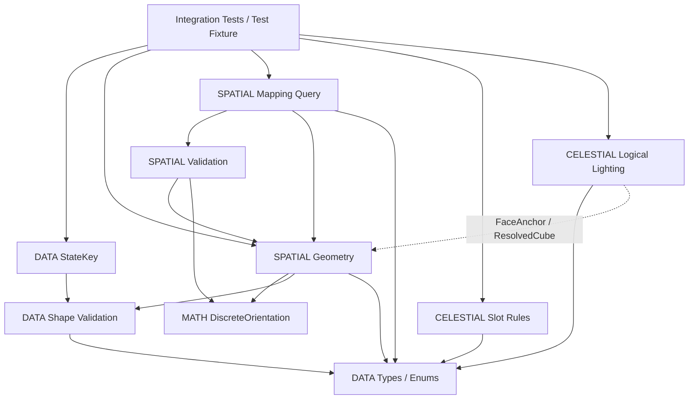

# FOUNDATION-1 — INTEGRATION REVIEW

Status: FOUNDATION_MATH_DATA_PASS

## Branch、来源与实际集成顺序

主仓库 `E:/godot/若叶睦/方块少女-若叶睦`，分支 `feat/foundation-core`。开始时 HEAD 严格为 `b360bfe20f01dca164ac31e1b214ed018d5250fa`，working tree clean，符合用户前置条件。

先只读审查来源代码、计划、报告、公共合同与0.1 reconciliation，再按指定顺序创建保留历史的merge提交：

| 顺序 | 来源分支 / 完整来源commit | 本轮merge commit |
|---|---|---|
| 1 A | feat/foundation-orientation-math / 10b1fb1a564c500d58b7d8ecc2343baef74942e3 | 69ed970974188cf69248ae8a8f7513bc05d0787c |
| 2 D | feat/foundation-data-contracts / 38894843c682be7f42be8fe4dad0c512d87ffebf | 30f3f54e66fc72adc4ed45fc276f66fc76d8bff2 |
| 3 B | feat/foundation-spatial-model / ebeabef11adcc5aa588a74ef290748b14a455c3a | 2e2f928c572c6c648db6ea30f412f6cdcfc4dc8b |
| 4 C | feat/foundation-celestial-lighting / 84781cc6b7e00b96c60c69f15ea16adbe06bd4ee | be1d79d908a01c8b594d5141df59cf38d77b765e |

四来源集成后的 HEAD 为 `be1d79d908a01c8b594d5141df59cf38d77b765e`；此后本轮测试适配、联合测试与本报告以独立验收提交保存，最终交付HEAD见交付消息及Git历史。没有rebase、squash、force push、merge main、push main或删除功能分支；未推送任何分支。当前工具无可调用GitHub Desktop原生控制入口，采用Git执行已授权集成。

## Git conflicts / Semantic conflicts

- A/C直接合并，无冲突。
- D只有DATA plan冲突：中央0.1未完成勾选与D完成勾选、历史记录重叠。逐段核对要求相同，保留D完成版本。
- B有DATA plan和Spatial plan冲突：B携带中央0.1的旧DATA进度，不覆盖已集成D的完成记录；Spatial保留B完成记录。未对代码机械采用ours/theirs。
- 两份公共Spec及reconciliation report相对b360bfe没有变化；A/C旧基线没有覆盖中央合同。
- 无生产代码冲突，无新增公共合同矛盾。C测试旧裸快照消费是已记录的接口适配项：初次真实运行exit1，130 checks中7项失败并出现anchors/cubes访问错误；改为先检查ok再消费value，最终132/0，生产LightQueryResult和算法不改。
- 源D报告两行Markdown硬换行含双空格；合并时保留原文，未将已有合法Markdown换行作为算法错误。新改动普通diff --check通过。

## Contract Diff Review / Duplicate implementation audit

| 审查对象 | 结论 |
|---|---|
| DiscreteOrientation / cube24.v1 | FOUNDATION唯一生产Owner是orientation/discrete_orientation.gd；固定24表、identity0、compose先b后a、inverse transpose、六个±90°ID与中央合同一致 |
| 其它模块compose/inverse | 未发现复制；Spatial用正式columns/compose/apply，宽整数位置变换属于Spatial职责 |
| FaceDirection / SurfaceFrame | 唯一canonical枚举由DATA定义；几何六面由Spatial提供U/V/N；DATA的名字/范围白名单是schema验证，不是另一套Face几何或全局类型 |
| FaceAnchor / AnchorOverlap | Shared Space半格Vector3i，position2三个分量完全相等；没有float epsilon/投影/距离阈值 |
| Overflow | 唯一公共ARITHMETIC_OVERFLOW=1105；Spatial检查int32输出，Lighting检查int64有理中间量，两者并非重复算法 |
| StateKey | 仅contracts/state_key.gd::build；唯一statekey.v1 canonical String；完整六状态字段与level hash/rule namespace |
| Mapping | DATA四态NONE/UNIQUE/AMBIGUOUS/ERROR；三个显式阶段；候选完整ID canonical排序；没有择第一、光照/blocked/busy筛选 |
| Compatibility | SAME_NORMAL/OPPOSITE_NORMAL纯几何；没有在此实施姿态更新或ShiftPermission |
| Celestial | 消费正式Spatial值记录，未复制层级变换、Anchor推导或Mapping；自己的闭AABB有理射线属于Lighting职责 |
| Production test-double leakage | 无；production preload只指向foundation正式脚本，未引用tests/.godot/外部worktree；所有新增fixture/adapter仅在tests内 |

10个FOUNDATION生产脚本及其UID与各自来源commit逐字一致，本轮不需要删除或重写任何生产算法。旧P-01的prototype/perspective/cube_orientation.gd按用户要求保留并回归：它是未迁移的旧系统，不能把“FOUNDATION只有一个canonical Owner”误报成整个仓库只有一份历史旋转代码。

## 最终模块依赖图

箭头表示消费者→依赖；虚线为值记录合同，非算法调用。没有production→test依赖。

## 新增真实联合测试

新增1个联合测试入口、1个仅测试fixture、1个运行wrapper。入口有5组测试方法，覆盖用户要求的6条跨模块链，共 **105项断言**，不是105个独立关卡。所有依赖从本主仓库res://foundation装载；不复制生产文件到临时integration-project。

- [foundation_fixture.gd](E:/godot/若叶睦/方块少女-若叶睦/tests/foundation/integration/foundation_fixture.gd)：Surface3 Cube、Inner2 Cube；SAME、OPPOSITE、无重合变体、真实遮挡Cube、A/B两Slot；两组、两机关状态、两个flag使StateKey排序测试使用非空集合。Face由正式make_face_nodes生成。只是数据fixture，不是P-02或Baker结果。
- [test_foundation_integration.gd](E:/godot/若叶睦/方块少女-若叶睦/tests/foundation/integration/test_foundation_integration.gd)：真实DATA/MATH/SPATIAL/CELESTIAL联合断言。
- [run_validation.ps1](E:/godot/若叶睦/方块少女-若叶睦/tests/foundation/run_validation.ps1)：六套件、独立日志、进程退出码/错误扫描/60秒超时、证据目录禁止覆盖。
- [C既有测试适配](E:/godot/若叶睦/方块少女-若叶睦/tests/foundation/celestial/test_celestial.gd)：仅快照包装读取、失败早退和重排路径；不改变生产API。

### Mapping联合验证

正式Cube/Face经DATA→Spatial生成真实快照：NONE；SAME_NORMAL UNIQUE；OPPOSITE_NORMAL UNIQUE；半格差一单位不重合；翻转Shift限制不改变几何结果；重排worlds/cubes/faces/groups/启用模式不改变结果。

AMBIGUOUS依中央0.1合同使用独立完整collection做resolution测试：两个候选取自两个分别有效的真实快照，拼成测试输入验证canonical排序、1401、mapping=null。**这不证明存在一个结构合法的多目标空间构型**。真实同位置相对内部目标面同时walkable时，结构校验先报SEALED_WALKABLE_FACE→ERROR；联合测试明确验证该结果，没有放松结构约束来凑AMBIGUOUS场景。

### Orientation / Lighting / Slot联合验证

六个±90°通过正式quarter_turn IDs驱动World；以固定独立法线golden和正式apply/compose验证FaceAnchor、normal、完整Frame，再用正式inverse恢复完整快照。测试没有重写旋转数学。

Lighting只消费成功真实快照中的FaceAnchor与ResolvedCube：遮挡Cube→SHADOW并定位blocker；将真实blocker移出射线→LIT；同一Face背向→SHADOW。两世界均从同一已提交PuzzleState.celestial.slot_id查找Slot，而非直接挑测试常量；SET A→B先返回候选且不提交，测试调用者提交唯一Slot后，两世界均LIT→SHADOW。没有实现Scheduler/busy锁或Runtime事务。

### StateKey / Overflow联合验证

真实Cube/Face/Orientation/Slot ID组成合法PuzzleState；三个非空map逆序插入key不变，完整String用于visited去重；姿态、Slot变化key不同；RotateTarget、Camera、FaceLightState、AnchorOverlap、ShiftMapping、Connectivity、debug、animation混入状态均UNKNOWN_FIELD且空key。状态仍严格六字段，derived不参与。

三类真实合法DATA输入触发ANCHOR/WORLD/GROUP范围失败：Spatial.value=null、1105；Mapping保留原始issues→ERROR/无候选；测试消费者在失败边界停止，计数确认正式Lighting.query没有被调用。传播仅为测试adapter，不将第二套生产wrapper或非法快照塞给Lighting。

## FOUNDATION测试结果

Godot `4.7.2.stable.steam.ed1daf0bf`。本次在集成主仓库真实运行，以下为最终全量结果，重复运行不累计：

| 套件 | checks | 结果 |
|---|---:|---|
| Orientation | 77,965 | PASS |
| Data Contracts | 733 | PASS |
| StateKey | 546 | PASS |
| Spatial | 1,533 | PASS |
| Celestial | 132 | PASS |
| 新Foundation Integration | 105 | PASS |
| **总计** | **81,014** | **全部exit0，六份stderr为空** |

执行：`tests/foundation/run_validation.ps1 -EvidenceName integration_final`。日志位于主仓库`.godot/foundation-1-validation/integration_final/`；wrapper保存results.json和分套件stdout/stderr。StateKey黄金字符串仍347/428字节，原655结构用例及旧范围失败回归未删除。

独立只读复审发现共享Slot测试最初直接选a/b值，没有通过state.slot_id消费。已改为按正式状态ID解析，并重新全量通过；复审确认修复后无剩余重要发现。复审不代替下面的旧图形回归。

## P-01与旧系统回归

使用未修改的既有wrapper：`tests/gameplay/run_p01_validation.ps1 -EvidenceName foundation1_p01_final -IncludeRegressions`。原入口串行调用Perspective、旧Puzzle和资源运行场景，整条链最终exit0。额外运行既有Cube/Sprite/Polish测试；没有迁移P-01到FOUNDATION。

| 旧系统检查 | 本次结果 |
|---|---|
| Cube Orientation Logic / Perspective Logic | 66 checks，24姿态，PASS；新A套件另有316项旧姿态parity |
| Cube Orientation Runtime | 632 checks，PASS |
| Perspective bugfix Runtime | 172 checks，PASS |
| Perspective Runtime | 54 checks，PASS |
| 正式P-01 State | 31 checks，108 reachable / 108 solvable，PASS |
| 正式P-01 Runtime | 167 checks，PASS，含按键/鼠标事件路线与Reset |
| 早期Puzzle State / Input | 50 checks，94/94状态可解；Input PASS |
| 早期Puzzle Runtime | 3451 checks，PASS |
| Sprite / Tileset / Mechanism资源Runtime | 三者ENGINE_RUN_PASS / ENGINE_CHECKS_PASS，failures=[] |
| 正式Orientation Sprite资源 | 857 checks，178frames/skin，PASS |
| 正式Orientation Sprite Runtime | 1780 checks，PASS |
| P-01 Polish Runtime / Pixels | 74 / 48 checks，PASS；音频峰值0.0885103，voices=3 |

图形测试实际使用Windows DisplayServer、D3D12 / Forward+、NVIDIA GeForce RTX 5060 Ti；不是以headless替代Runtime。除下述Polish退出警告，其余最终运行日志stderr为空；图形报告failures=[]，进程全部exit0。回归截图已实际生成，抽看P-01鼠标路线终点图像正常。自动输入事件回归不冒充新的真人试玩；本轮未控制系统键鼠完成手动游玩。

Polish Runtime退出时报告4个ObjectDB实例未释放，无ERROR或失败断言。同一警告已存在于历史`tests/gameplay/evidence/p01_polish/final_main.stderr.log`、`pixels.stderr.log`及`pixels_verbose.stderr.log`，属于保留的旧退出清理问题；本轮没有修改旧玩法代码来掩盖警告。

**保留的失败与边界：** 初次wrapper `foundation1_p01_regression` 的Perspective定时持键段出现3项失败（释放前少走一格，后续四滚姿态检查连带失败），其余定向回归通过。旧脚本在0.77秒墙钟后检查移动进度；该次失败的精确外部时序/焦点原因未唯一确定，不能断言由某个窗口或GPU造成。只在ignored目录复制原测试并加入诊断输出，隔离运行54/0、held={W}、moves=2且第三滚进行中；随后未修改的原wrapper整链54/0。没有为通过而修改旧测试期望、玩法或公共合同。首次日志、隔离探针、最终完整重跑分别保留，作为旧定时验收的偶发性watchpoint。Runtime按帧检查数量可随实际帧数变化，不把3451/3452等计数差异当行为修改。

系统默认Python缺Pillow，静态Sprite检查改用已提供的bundled Python后857项通过；未安装依赖或修改资产。Polish像素旧脚本写死历史证据路径，使用ignored目录中的原文副本仅替换证据输出目录，避免覆盖历史图片，逻辑未改。

## 最终一致性检查

| 用户问题 | 答复 |
|---|---|
| 1. Orientation Math是否只有一个生产实现 | FOUNDATION是，唯一MATH Owner；旧P-01历史实现按不迁移约束独立保留 |
| 2. statekey.v1是否只有一个生产实现 | 是，DATA StateKey.build |
| 3. ARITHMETIC_OVERFLOW是否只有1105 | 是，无别名 |
| 4. Spatial是否消费正式Orientation | 是，正式preload与真实联合测试 |
| 5. Celestial是否消费正式Spatial | 是，消费真实FaceAnchor/ResolvedCube值；不复制Spatial算法 |
| 6. C snapshot wrapper是否正式同步 | 是，先ok再value；旧132项恢复通过 |
| 7. Candidate ordering是否确定 | 是，完整ID排序，打乱输入及歧义列表结果一致 |
| 8. Derived State是否排除StateKey | 是，混入正式状态直接拒绝，不静默省略 |
| 9. AnchorOverlap是否离散精确关系 | 是，半格整数完全相等 |
| 10. Lighting是否独立于视觉渲染 | 是，纯记录/整数射线；无渲染或物理服务器依赖 |
| 11. 是否有production test-double leakage | 无；fixture/adapter只在tests |
| 12. P-01是否保持原行为 | 状态、Runtime、姿态、资源、Polish及像素回归全部通过；旧业务及测试文件无diff |

## Git diff、证据与下一阶段

两份中央Spec与0.1报告保持b360bfe内容；game/、prototype/、production/、project.godot、原tests/gameplay、tests/prototype、tests/visual不改。Git只收正式实现、测试、必要计划/模块报告及本报告；.godot、evidence、日志、临时diff和截图均本地保留、不提交。

相对b360bfe共44个文件变化（40新增、4修改），6,168行新增、49行删除。实际文件按目录列出如下；所有`.gd`均包含对应`.gd.uid`，wrapper无UID：

| 目录 | 新增或修改文件 |
|---|---|
| foundation/orientation | discrete_orientation.gd |
| foundation/contracts | foundation_types.gd、contract_records.gd、contract_validation.gd、state_key.gd |
| foundation/spatial | surface_geometry.gd、spatial_validation.gd、mapping_query.gd |
| foundation/celestial | celestial_rules.gd、logical_lighting.gd |
| tests/foundation/orientation | test_orientation.gd |
| tests/foundation/contracts | test_contracts.gd、test_state_key.gd |
| tests/foundation/spatial | test_spatial.gd |
| tests/foundation/celestial | test_celestial.gd（合并后另作最小wrapper适配） |
| tests/foundation/integration | foundation_fixture.gd、test_foundation_integration.gd |
| tests/foundation | run_validation.ps1 |
| docs/development-records | FOUNDATION_ORIENTATION_MATH_REPORT.md、FOUNDATION_DATA_CONTRACTS_REPORT.md、FOUNDATION_SPATIAL_MODEL_REPORT.md、FOUNDATION_CELESTIAL_LIGHTING_REPORT.md、FOUNDATION_INTEGRATION_REPORT.md |
| docs/superpowers/plans | 修改2026-09-13-foundation-orientation-math.md、2026-09-13-foundation-data-contracts.md、2026-09-13-foundation-spatial-model.md、2026-09-13-foundation-celestial-lighting.md |

本轮四次merge以外的验收提交仅包含7个文件：C测试适配、两个联合测试脚本及其UID、运行wrapper、本报告。正式生产实现全部来自四个Owner提交。

本地证据路径（均相对主仓库，不进入Git）：

- `.godot/foundation-1-validation/integration_final/`：最终六套FOUNDATION结果及日志。
- `tests/gameplay/evidence/foundation1_p01_final/`、`foundation1_p01_final_regression/`：最终完整旧系统wrapper结果。
- `tests/gameplay/evidence/foundation1_extra/`：Cube、Orientation Sprite、Polish和像素补充运行结果。
- `.godot/foundation-1-integration/sprite-assets.log`：857项静态资源检查。
- `.godot/foundation-1-integration/c-before.*`：C适配前的失败证据。
- `tests/gameplay/evidence/foundation1_p01/`、`foundation1_p01_regression/`及`.godot/foundation-1-integration/perspective-isolated.*`：首次定时失败及隔离诊断，未删除。

下一阶段blockers：未发现合同或模块集成阻塞。保留上述旧定时测试偶发失败及ObjectDB退出清理警告供后续维护；没有将它们伪装成已修复。本次最终完整回归通过，旧源码与期望均保持不变。

下一阶段建议先评审最小PuzzleRuleKernel的稳定动作与ShiftPermission/全局事务接口、测试范围，再另行授权实施。本轮未启动Kernel、Runtime Shift、BFS/A*、Softlock、Ablation、Baker、Editor、Blender、P-02或P-01迁移。
