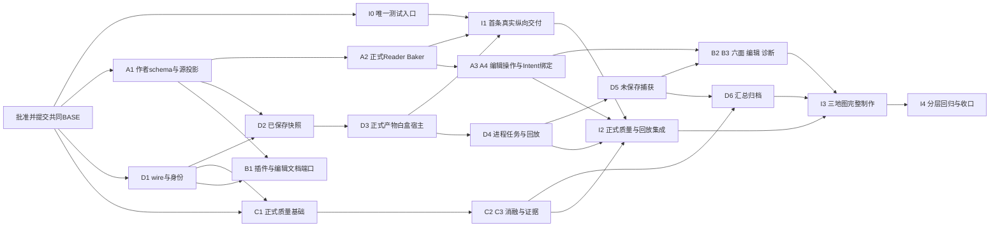

# FOUNDATION-4 Integration Implementation Plan

> **For agentic workers:** REQUIRED SUB-SKILL: Use superpowers:subagent-driven-development or superpowers:executing-plans to implement this plan task-by-task after explicit execution approval. Steps use checkbox (`- [ ]`) syntax. 本轮仅编制计划；后续拟采用四Owner独立worktree，具体启动仍须用户授权，不自动派生实现任务。

**Goal:** 把五份计划接成真实作者→Runtime首项交付及完整三地图流程，提供唯一共享测试入口和文件交接登记。

**Architecture:** 协调Owner仅维护集成文件/公共测试wrapper/工程装配。各Owner通过受控Git历史交付，运行时依赖取自已集成的同一checkout，不复制别的工作树生产文件。共同合同、接口登记和数值只有本计划这一处公共清单。

**Tech Stack:** Godot/GDScript、PowerShell、现有FOUNDATION公开接口；不增加第三方运行依赖。工程声明4.7特性，实际engine能力须在I0核验并绑定，不能把声明当运行验证。

**Spec:** [Design Spec](../specs/2026-09-22-foundation-authoring-editor-design.md)，SHA-256 `A4D9CD7CCFDE8E4FDB0EEA72746505B995361850E623BEF7952D49849EC9A13F`；[Tool Contracts](../specs/2026-09-22-foundation-authoring-tool-contracts.md)，SHA-256 `C31A03E807A2BF9268D32AA00FA18BCD93C77BAD4C53ED00A8D349FED8462A6B`。仅消费这两个已批准内容版本。

**Approval:** [独立批准记录](../../development-records/FOUNDATION_4_SPEC_APPROVAL_RECORD.md)。Spec旧front matter保持原字节，不再以其待审标记否认本次哈希批准。

**Date:** 2026-09-23 · **PLAN_DOCUMENTED** · **AWAITING_USER_REVIEW** · **IMPLEMENTATION_NOT_STARTED**。

## Global Constraints

- 唯一Reader/Baker/Codec、Kernel/Safety、Solver/Softlock/Intent/Trace与Session/Presenter/Replayer；不调用私有测试seam绕过正式验证，不产生第二算法。
- 4A定义作者/source_map；4D定义wire、快照/任务/报告及唯一状态视图；4C只编排质量；4B独占插件入口。跨Owner共享数据及已批准数值以[集成计划公共约束](2026-09-23-foundation-authoring-integration-plan.md)为单一计划登记，不复制出另一套协议。
- 两个World单位变换；玩法实例覆盖报错停链；六面不缺失/不重复；未知字段/版本失败。原始Transform交Reader，不提前量化。
- ANALYZE_CURRENT允许未保存但不签发整关PASS；ACCEPT_SAVED保存同轮闭包；失败不回退旧产物。完整验收固定UNFILTERED/FULL_GRAPH、零软锁、适用Intent、同一trace语义与GRAPHICAL MATCH。
- 取消立即撤销PASS资格；CANCELLING直到调用结束和自有资源释放确认；不强杀、不承诺有界回收。所有工具默认预算逐项沿合同§6，期限不等于硬终止。
- 源码/fixture入Git；生成日志、运行工程、导出和本任务可配置临时目录在E盘。无全局环境修改。tests-only double只能证明局部包装行为，真实链不得加载它。
- 本轮不创建实际.gd/.uid/.tscn/.tres/插件/测试；以下Create/Modify/Test均为将来实施任务。所有示例仅在Markdown内；全部Godot验收 **NOT_RUN**。
- 禁止写main、旧P-01及既有FOUNDATION生产模块；禁止写`E:/Study/方块娘项目/若叶睦/model/art_pilot_01`、`E:/Study/方块娘项目/若叶睦/photo`或运行Blender。白盒不等待美术，不引入旧像素尺寸约束。
- 不commit/push/merge/PR、不创建开发worktree。计划批准、执行方式授权、共同基线已提交是执行前置；任务REVIEW完成只形成可审阅差异，不自动提交。

## Review Focus

- 同hash旧报告在Undo后仍不可恢复当前PASS → I3当前性用例。
- 四Owner分别通过double却未接真实依赖 → I1/I2拒绝UNIT证据作为交付。
- 编辑器插件启停与正在取消的宿主并存 → I3编辑器卸载/重接用例。
- 首次发布失败与历史报告导出失败混同 → I3故障注入矩阵。
- 图形测试抢占美术进程、旧timer/polish失败被重跑抹掉 → I4独占窗口和不可覆盖证据。

## 范围与当前基线

本轮只生成计划。设计HEAD为`bfcc6c004db232ca2f4ea4d409c98bda0dc6d165`；`feat/foundation-core`为`821bce29fc94dbed42fafbe3f4a720b4715d4aa3`，比设计仅多README的251行。main实际`8a77874cc18ceb654664c3e9aeb10a2ccd318048`，保留7个未跟踪import。本地关系已核验，未fetch，不声称远端状态。

审批记录与五计划尚未提交；现在没有可用的“已批准共同实施基线”。下列提交槽位是交付登记名称，不是假造SHA：BASE=用户批准计划后包含正确Core、两个批准Spec原字节、批准记录、五计划的完整commit；A_SCHEMA/A_BAKE/A_EDIT、D_PROTOCOL/D_SAVED/D_HOST/D_JOBS/D_FULL、C_QUALITY、B_EDITOR、I_HARNESS分别由对应任务验收后登记真实commit。实际执行前必须将每个需要的槽位解析成40位SHA并验文件blob；未解析=DEPENDENCY_PENDING，禁止以当前HEAD或手抄文档冒充。

执行准备顺序（本轮不执行）：用户审阅五计划 → 明确授权四Owner独立worktree执行 → 用户单独授权Git提交已批准文档 → 核验BASE含正确Core及全部文档 → 从同一BASE创建四开发worktree → 单分支审查/收口 → 独立Integration worktree受控接入真实提交并复验。建议分支/路径沿用户给定4A/4B/4C/4D命名；如已存在先核验，不覆盖重建。集成worktree路径建议`E:/godot/worktrees/block-girl-foundation-4-integration`，也是待实施授权的候选，不在本轮创建。

## 公共约束表：已批准Tool Contracts §6原值

所有值来自被批准哈希的Tool Contracts §6（域约束另见§2.1），不使用旧SearchRecords.default_budget的0ms覆盖本表。配置在运行前校验、显示、冻结，进入policy_digest；不允许运行中改值。下面“可配置”指正式API已有相应参数且本合同要求记录实际值；计划不增加隐藏默认。协议项本版固定，变更需合同修订；可配置项调整须显式请求和重新生成policy_digest，不修改此默认表。

| 参数 | 原值 | 适用阶段 | 固定 / 可配置与含义 | 来源 |
|---|---|---|---|---|
| max_configurations | 4096 | Baker、SearchPolicy.validation_options | 可配置正整数；本版默认4096 | §6 |
| max_checks | 100000 | Baker、SearchPolicy.validation_options | 可配置正整数；本版默认100000 | §6 |
| max_states | 10000 | 原图及Ablation每次baseline/子搜索 | 可配置>0 | §6 |
| max_edges | 100000 | 同上SearchBudget | 可配置>=0 | §6 |
| max_depth | -1 | 同上SearchBudget | 可配置>=-1；-1无限深度 | §6 |
| max_runtime_ms | 30000 | 同上SearchBudget | 可配置>=0；0按正式合同禁用模块墙钟，默认保持30000 | §6、§2.1 |
| max_action_evaluations | 200000 | 同上SearchBudget | 可配置>0 | §6 |
| max_nodes | 10000 | Softlock | 可配置>0 | §6 |
| max_edges | 100000 | Softlock | 可配置>=0 | §6 |
| max_runtime_ms | 30000 | Softlock | 可配置>=0 | §6 |
| mode | GRAPHICAL（正式枚举值1） | 完整验收Replayer | 完整验收固定；LOGICAL不能替代 | §6、§2.1 |
| max_steps | 10000 | Replayer | 可配置，须过原公开options校验 | §6 |
| max_runtime_ms | 60000 | Replayer | 可配置，须过原公开options校验 | §6 |
| step_timeout_ms | 5000 | Replayer | 可配置，须过原公开options校验 | §6 |
| 内置max_configurations / max_checks | 4096 / 100000 | Replayer内部静态验证 | **旧API固定**，不接受validation_options | §6、§2.1 |
| 工具阶段期限 | 300000ms | 父4D对每工具阶段观察 | 本版默认；显式调整进入policy_digest；只触发停链，不保证进程回收时间 | §6 |
| 父租约续租间隔 | 1秒 | 4D父服务→宿主 | 本版协议固定；不是搜索进度回调 | §6 |
| 父租约失效阈值 | 30秒 | 宿主在可检查调用边界 | 本版协议固定；下一边界退出，不中断同步调用 | §6 |
| wire单附件上限 | 128MiB（134217728字节） | wire读取/写入 | 本版默认限额；显式调整进入policy_digest | §6 |
| wire值树深度 | 64 | wire解析/编码 | 本版默认限额；显式调整进入policy_digest；计划计数约定见D1 | §6 |

Ablation使用同一明确传入的搜索预算，但每次内部baseline/子搜索分别计费、记录；30000ms不能冒称整个Ablation阶段的总时限。工具超时、正式预算耗尽、取消、崩溃分开表达。固定完整原图策略为BFS/FULL_GRAPH/UNFILTERED、空Callable，正式枚举不重定义。

## 唯一Owner与共享记录（计划级细化，实施前随计划一起审阅）

所有工具记录均为Dictionary，键String，工具状态token为String；正式ID保持StringName、正式枚举保持int、正式记录字段不扩展。无列出的字段即拒绝。`T?`表示T或null；数组注明元素类型。所有方法末尾的Dictionary返回必须按下面schema解释，不能作为无约束Variant袋。

| 记录 / 唯一Owner | 完整字段与类型 / 来源 |
|---|---|
| ToolIssue / 4D | `{code:String,stage:String,path:String,message:String,source_refs:Array[Dictionary],upstream:Array[Dictionary]}`；source_refs使用4A SourceMap.Entry；upstream保留原ValidationIssue/AnalysisIssue，不改变码。4A为避免对4D代码依赖按此值合同产出，不另定义wire |
| Result / 所属接口 | `{ok:bool,value:Variant或null,issues:Array[ToolIssue]}`；value类型由各接口表指定；特殊Bake/Bind/Quality结果见Owner计划，不套通用包装改旧结果 |
| LevelRef / 4D | `{level_authoring_id:String,level_id:StringName,root_source_uri:String}` |
| SnapshotIdentity / 4D | `{run_id:String,snapshot_id:String,source_fingerprint:String,source_intent_digest:String或null}`；4A只消费纯值并回传Intent摘要，不写第二摘要算法 |
| RunIdentity / 4D | Tool Contracts §6全部字段；versions使用§5快照版本清单，execution_digest独立绑定；生成规则由D1实现 |
| ExecutionPolicy / 4D | `{entry_kind:String,stages:Array[String],bake_options:Dictionary,search_mode:int,search_budget:Dictionary,softlock_budget:Dictionary,replay_options:Dictionary,stage_deadline_ms:int,lease_interval_ms:int,lease_timeout_ms:int,max_wire_bytes:int,max_wire_depth:int}`；预算字段及默认恰为上表；mode区分局部与完整验收。父接口生成policy_digest，不把Callable放入wire |
| ArtifactRef / 4D | `{relative_path:String,byte_length:int,sha256:String,format_version:String}`；路径限制包内；bytes摘要由D1统一计算 |
| SnapshotRef / 4D | `{identity:SnapshotIdentity,level_ref:LevelRef,input_mode:String,input_manifest:ArtifactRef,execution_digest:String,root_path:String}`；root_path只用于本机服务定位，不进入源摘要；wire交换用包内引用 |
| RunRequest / 4D | `{entry_kind:String,level_ref:LevelRef,policy:ExecutionPolicy}`；EditorContext见4B；独立回放另有同轮canonical_ref/trace_ref参数 |
| BoundaryControl / 4D | 仅进程内对象，`stop_requested()->bool`、`reason()->String`、`checkpoint(stage_id:String)->bool`；4C仅在正式调用前后调用。不能序列化或传给旧算法options |
| StageRecord、Report、SourceMap | 精确字段沿Tool Contracts §7/§8；StageRecord构造/报告schema归4D，SourceMap及Entry归4A。4C返回StageRecord值，不拥有顶层verdict |
| QualityRunResult / 4C | `{run_identity:RunIdentity,selected_trace_ref:Dictionary或null,stages:Array[StageRecord],issues:Array[ToolIssue]}`；内存selected_trace_ref为`{trace:Dictionary,origin:String}`，origin固定ORIGINAL_GRAPH；4D归档形状固定为`{trace:ArtifactRef,origin:String}`，保留origin；读取后仍须正式Trace校验，不能把附件引用当内存trace。图留内存正式返回，存储表达沿合同§7 |
| ViewRequest / 4D | Tool Contracts StateInspectionRequest全部字段；state_ref在进程内为`{level:Dictionary,state:Dictionary}`，只读归档解析后重建；state_key必须正式验证；不含Session |
| ViewHandle / 4D | `{view_id:String,root:Node3D,origin:String,state_key:String}`仅本进程UI；不序列化；释放接口移除所有自有节点 |
| ExportResult / 4D | `{ok:bool,source_manifest:ArtifactRef,destination:String,published_manifest:ArtifactRef或null,issues:Array[ToolIssue]}`，独立于历史report |

AuthoringDocument/Payload/EditProposal、EditorContext详见A/B计划字段表；它们的定义及创建任务分别A1/A3/B1。以下使用的测试支持接口由I0明确创建，不能在测试中偷偷假定已经存在。

## 依赖与并发顺序



A1、D1、C1的算法准备及I0可并行；C1的正式run_quality调用验证须待D_PROTOCOL实际交付，此前局部边界double只能登记Unit。4B可先以tests-only服务double做UI单元，但EditorContext的独立真实QA依赖A_SCHEMA；插件服务接入和启停复验还必须等待D_JOBS，不能把D_PROTOCOL当成现成任务服务。D2对未到A_SCHEMA停止，A2不依赖D完整进程服务；C1/C2可用已有正式fixture的Baker产物开展算法调用，仍须I2接真实作者输入。D3先消费D2保存输入与A2产物，I1不等全Dock/未保存链；其后D4/D5/D6补完整协议。不存在四个模块完全独立的承诺。

| 交付点 | 内容 / 消费位置 | 固定依赖与复验负责人 |
|---|---|---|
| I_HARNESS / I0 | `run_module.ps1`、test_suite.gd、case_manifest.json | Integration交付真实SHA；各Owner按本计划命令验证自己模块 |
| A_SCHEMA / A1 | 作者组件、字段schema、project_document/assemble_payload | 4A交付；4B文档端口、4D捕获使用；A1+ D2/B1实际用例复验 |
| A_BAKE / A2 | 唯一临时profile→Reader/Baker及source map | 4A交付；D2/I1接入；Integration负责I1，禁止用旧fixtureLevel替代 |
| A_EDIT / A3–A4 | 编辑proposal、专用化、Intent绑定/来源映射 | 4A交付；4B事务、4C绑定输入；B2/C2/I3复验 |
| D_PROTOCOL / D1 | wire、identity、ExecutionPolicy与StageRecord值合同 | 4D交付；各Owner只消费，不复制实现；D1/C1/B1复验 |
| D_SAVED/D_HOST / D2–D3 | 保存快照、受控工程、canonical装载与通用宿主 | 4D交付；I1首项真实链；不宣称完整验收已实现 |
| D_JOBS / D4 | 单槽、合作取消、IPC、真实整段回放 | 4D交付；4C边界停止、4B状态UI；I2/4D-4复验 |
| C_QUALITY / C1–C3 | 正式质量链原始记录 | 4C交付；D6唯一汇总；I2复验；无顶层PASS |
| B_EDITOR/D_FULL | B1–B4、D5–D7真实服务 | 原Owner交付；Integration接入I3三地图，禁止替身 |

阶段ID在D1登记唯一枚举：AUTHORING、BAKE、INTENT_BIND、INTENT_VALIDATE、ORIGINAL_GRAPH、SOFTLOCK、ABLATION、TRACE_SEMANTICS、MILESTONES、GRAPHICAL_REPLAY、MANUAL_RUNTIME、ARCHIVE。前期ANALYZE_CURRENT可显式只选AUTHORING/BAKE/MANUAL_RUNTIME，不具验收资格；ACCEPT_SAVED不得由调用方裁掉必需阶段。新阶段须改此公共登记，不能Owner各自起别名。

依赖未交付：记录DEPENDENCY_PENDING＋缺失槽位/文件/所阻用例，已完成本模块单元可审阅但不写端到端PASS；停止依赖步骤，继续无依赖步骤。实际接口与获批计划不符才CONTRACT_MISMATCH，给出签名/返回差异，受影响任务停审，不能静默适配第二协议。接入在各自空闲受控分支/独立集成worktree通过经授权的Git历史进行；协调者不进入仍运行的Owner工作树代写，不从外部工作树复制生产文件。

## 精确文件所有权

下列路径相对实施worktree根；同名`.gd.uid`逐项归同Owner，实施导入后纳入正式源依赖。未列文件不得顺手修改。表内tests/路径同时是本任务的Test文件；Create表示未来创建，后续任务对同Owner已创建文件的扩展仍由该Owner维护。

| 操作 | 文件 | 责任 / 创建任务 |
|---|---|---|
| Create | `tests/foundation/authoring_integration/run_module.ps1` | I0：唯一新测试wrapper：模块/用例/模式分发，依赖检查与证据 |
| Create | `tests/foundation/authoring_integration/case_manifest.json` | I0：精确测试文件及模式登记，无动态任意script参数 |
| Create | `tests/foundation/authoring_integration/test_suite.gd` | I0：统一计数/结果输出与NOT_RUN识别 |
| Create | `tests/foundation/authoring_integration/test_suite.gd.uid` | I0：对应脚本持久UID，只在所属任务受控导入生成 |
| Create | `tests/foundation/authoring_integration/test_saved_vertical.gd` | I1：真实作者修改到Runtime行为差异 |
| Create | `tests/foundation/authoring_integration/test_saved_vertical.gd.uid` | I1：对应脚本持久UID，只在所属任务受控导入生成 |
| Create | `tests/foundation/authoring_integration/test_quality_replay.gd` | I2：作者产物到正式质量和真实回放 |
| Create | `tests/foundation/authoring_integration/test_quality_replay.gd.uid` | I2：对应脚本持久UID，只在所属任务受控导入生成 |
| Create | `tests/foundation/authoring_integration/test_workflow_maps.gd` | I3：三地图/保存重开/失效/归档断点检查 |
| Create | `tests/foundation/authoring_integration/test_workflow_maps.gd.uid` | I3：对应脚本持久UID，只在所属任务受控导入生成 |
| Create | `tests/foundation/authoring_integration/editor_workflow.gd` | I3：由4B QA driver调用的真实Editor跨模块case |
| Create | `tests/foundation/authoring_integration/editor_workflow.gd.uid` | I3：对应脚本持久UID，只在所属任务受控导入生成 |
| Create | `tests/foundation/authoring_integration/dependency_receipts.json` | I0：运行前填写真实BASE/Owner提交、源摘要，不预填虚构SHA |
| Modify | `project.godot` | I3：只追加启用4B唯一插件项，保留main_scene、输入、渲染/P-01配置 |
| Create | `docs/development-records/FOUNDATION_4_INTEGRATION_REPORT.md` | I4：实际运行/失败/未运行和提交收口，实施阶段才创建 |
| Create | `tests/foundation/authoring_integration/maps/a_empty/level.tscn` | I1：正式作者源fixture，无专属玩法脚本 |
| Create | `tests/foundation/authoring_integration/maps/a_empty/surface.tscn` | I1：正式作者源fixture，无专属玩法脚本 |
| Create | `tests/foundation/authoring_integration/maps/a_empty/inner.tscn` | I1：正式作者源fixture，无专属玩法脚本 |
| Create | `tests/foundation/authoring_integration/maps/a_empty/intent.tres` | I1：正式作者源fixture，无专属玩法脚本 |
| Create | `tests/foundation/authoring_integration/maps/b_mechanics/level.tscn` | I2：正式作者源fixture，无专属玩法脚本；I3复验 |
| Create | `tests/foundation/authoring_integration/maps/b_mechanics/surface.tscn` | I2：正式作者源fixture，无专属玩法脚本；I3复验 |
| Create | `tests/foundation/authoring_integration/maps/b_mechanics/inner.tscn` | I2：正式作者源fixture，无专属玩法脚本；I3复验 |
| Create | `tests/foundation/authoring_integration/maps/b_mechanics/intent.tres` | I2：正式作者源fixture，无专属玩法脚本；I3复验 |
| Create | `tests/foundation/authoring_integration/maps/c_repair/level.tscn` | I3：正式作者源fixture，无专属玩法脚本 |
| Create | `tests/foundation/authoring_integration/maps/c_repair/surface.tscn` | I3：正式作者源fixture，无专属玩法脚本 |
| Create | `tests/foundation/authoring_integration/maps/c_repair/inner.tscn` | I3：正式作者源fixture，无专属玩法脚本 |
| Create | `tests/foundation/authoring_integration/maps/c_repair/intent.tres` | I3：正式作者源fixture，无专属玩法脚本 |

`.gitignore`已有`.godot/`与`tests/gameplay/evidence/`，本计划无需修改；不可忽略正式测试fixture。插件`plugin.cfg`及入口脚本归4B，工程启用列表只归Integration；MOC只允许协调者维护，本轮现有索引链接已覆盖决策页，仅在决策页追加计划摘要，不重复改MOC；未来四Owner不写MOC。旧wrapper只读复用，不改其watchdog/断言来掩盖新问题。

## 公共测试入口与证据合同（新建于I0，目前不存在）

`run_module.ps1 -Module <4A|4B|4C|4D|Integration> -Case <任务ID|All> -Mode <Unit|Real|Graphical|Editor> -EvidenceName <唯一安全目录名> [-Godot <绝对exe>]`。`-Godot`默认沿真实旧入口`D:/APP/steam/steamapps/common/Godot Engine/godot.windows.opt.tools.64.exe`，先检查存在/版本；EvidenceName必填，拒绝覆盖。用例集合从case_manifest.json读取，未知组合失败，不能吞掉未注册测试。

wrapper只负责测试执行，不实现产品worker/任务状态机/wire。case_manifest逐项指向Owner测试文件；新增登记由Integration Owner接收明确路径后统一更新。所有命令在待测实施/集成worktree根执行，证据写该E盘项目`.godot/foundation-authoring-tests/<EvidenceName>/`，独立于产品run目录。设置仅子进程TEMP/TMP/用户数据到此证据目录。保存engine身份、arguments、源及依赖SHA、mode、exit、stdout/stderr、checks/failures、double清单和图形display。

I0创建的测试登记也采用封闭字段（仅测试设施JSON，不是第二工具wire）：case_manifest=`{manifest_version:String,cases:Array[Case]}`；Case=`{module:String,case_id:String,mode:String,script:String,entry:String,required_slots:Array[String],allows_double:bool}`，entry仅SELF_CHECK/SCENE_TREE/EDITOR，script为本计划清单中的res路径，SELF_CHECK由wrapper生成隔离临时case。dependency_receipts=`{schema_version:String,base_commit:String,engine:{path:String,sha256:String,version:String},deliveries:Array[Delivery]}`；Delivery=`{slot:String,commit:String,paths:Array[{path:String,sha256:String}]}`，path为仓库相对路径。I0自检只要求BASE；各Owner按实际消费者登记其最小required_slots，不要求尚未开始的后续任务先交付。I0静态检查全部任务ID及支持模式，I3/4D-5等Editor脚本明确交QA driver运行。

默认不设置另一套产品超时或强杀；产品期限测试通过4D自己的批准policy驱动。测试宿主若不返回，记录未完成/待释放，操作者可处理自有测试进程，但不能伪称产品有有界回收。旧回归wrapper已有其自有测试进程watchdog，属于历史测试设施，不升级为新产品取消合同。

`test_suite.gd`（extends SceneTree）公开`check(condition:bool,label:String)->void`、`finish()->void`、`evidence_dir()->String`、`mode()->String`；派生脚本`run()->void`可async。初始化deferred调用run，finish写`{checks:int,failures:Array[String],mode:String,display:String,doubles:Array[String]}`，checks必须>0，失败退出1、成功退出0。入口/依赖缺失由wrapper标DEPENDENCY_PENDING并退出2；不得计为预期RED或通过。Editor用例由4B QA driver在真实EditorPlugin上下文运行，返回同一结果schema；外部wrapper只核验输出，不模拟EditorInterface。

Unit允许tests-only场景/文件/边界控制double，Real/Graphical/Editor交付用例拒绝任何double加载路径。用于故障注入的子case须显式记录注入点，不能替代正常完整链。文中代码片段置于已说明test上下文，生产实现片段是最小算法边界，未列部分按字段表/断言完成，不代表可直接把片段另存运行。

### I0 — 建立真实依赖收据与唯一测试入口

**Files:** `tests/foundation/authoring_integration/run_module.ps1`, `tests/foundation/authoring_integration/case_manifest.json`, `tests/foundation/authoring_integration/test_suite.gd`, `tests/foundation/authoring_integration/dependency_receipts.json`（操作见文件表，包含相应UID）。

**Interfaces — consumes:** 批准BASE；现有run_validation.ps1的实际参数和证据约定；各Owner本计划精确文件表

**Interfaces — produces:** 上述run_module.ps1参数；TestSuite公开方法；case_manifest与dependency_receipts封闭JSON记录

- [ ] **RED：** 先创建wrapper及TestSuite，在测试用例不存在/提交槽位未解析时断言退出2并标DEPENDENCY_PENDING；注册一个最小失败断言证明退出1不是0。
- [ ] **运行RED：** `pwsh -NoProfile -File tests/foundation/authoring_integration/run_module.ps1 -Module Integration -Case I0 -Mode Unit -EvidenceName integration_i0_01`。必须看到指定行为断言失败；首次入口尚未创建时先按I0登记入口，不能把无关依赖加载失败当作行为RED。保存失败参数/日志，不覆盖。

代表性断言片段（普通case位于I0 TestSuite派生脚本的`run()`；Editor case位于QA driver调用的`run(editor_plugin,tools_plugin)`，在该case定义同义的本地`check(bool,String)`并返回相同计数结果。片段为测试意图，前置动作/变量在对应RED步骤实现，不是独立可执行脚本）：

```gdscript
# I0自检临时用例只在证据工程生成，不进入产品源码。
check(false, "harness must reject a real failing assertion")
finish()
```

- [ ] **GREEN：** 实现manifest驱动的路径检查、记录与退出码；SELF_CHECK外层必须同时观察故意失败子case退出1、依赖缺失子case退出2、真实成功子case退出0且checks>0，然后自检才退出0，不能删去失败断言伪称wrapper正确。测试数据通过后才开放I_HARNESS。禁止用exit0或PASS文本单独作判断，禁止吞掉stderr脚本错误。
- [ ] **运行GREEN：** 同一命令改用新的`-EvidenceName`后执行；预期退出0、实际checks>0、failures=[]、无脚本错误；证据标注mode、依赖提交/摘要与是否使用double。没有执行时保持NOT_RUN。
- [ ] **REVIEW：** 确认没有产品wire/作业逻辑、不会从其它Owner工作树复制生产文件；现有源码只读；实际BASE与脚本hash被保存。 记录文件差异和依赖交接，等待允许的Git收口流程；此步骤不自动commit。

### I1 — 首条已保存作者修改到白盒Runtime

**Files:** `tests/foundation/authoring_integration/test_saved_vertical.gd`, `tests/foundation/authoring_integration/maps/a_empty/level.tscn`, `tests/foundation/authoring_integration/maps/a_empty/surface.tscn`, `tests/foundation/authoring_integration/maps/a_empty/inner.tscn`, `tests/foundation/authoring_integration/maps/a_empty/intent.tres`（操作见文件表，包含相应UID）。

**Interfaces — consumes:** A1.project_document/assemble_payload；A2.bake_authoring；D2.capture_saved；D3.WhiteboxHost.load_artifact/submit_action；正式Codec/Session

**Interfaces — produces:** 真实源地图a_empty；两轮run及产物/运行证据，不是顶层完整Acceptance PASS

- [ ] **RED：** a_empty先用Surface直线相邻三个TOP可行走Cube：floor(0,0,0)、middle(1,0,0)、exit(2,0,0)，Spawn在floor/TOP，Goal在exit/TOP；Inner同空间独立Cube、合法天体Slot及最小已支持USE配置，有效显式空Intent。只将非终点middle.TOP.walkable由true改false并保存，同一正式MOVE前后应APPLIED/REJECTED，旧产物不得被装载。
- [ ] **运行RED：** `pwsh -NoProfile -File tests/foundation/authoring_integration/run_module.ps1 -Module Integration -Case I1 -Mode Graphical -EvidenceName integration_i1_01`。必须看到指定行为断言失败；首次入口尚未创建时先按I0登记入口，不能把无关依赖加载失败当作行为RED。保存失败参数/日志，不覆盖。

代表性断言片段（普通case位于I0 TestSuite派生脚本的`run()`；Editor case位于QA driver调用的`run(editor_plugin,tools_plugin)`，在该case定义同义的本地`check(bool,String)`并返回相同计数结果。片段为测试意图，前置动作/变量在对应RED步骤实现，不是独立可执行脚本）：

```gdscript
const RuleTypes = preload("res://foundation/rules/rule_types.gd")
# Before/after都通过D2保存捕获与4A正式Bake；下面变量来自本测试两个独立run。
check(before_bake.ok and after_bake.ok, "both authoring revisions bake")
check(before_bake.level.content_hash != after_bake.level.content_hash, "author change reaches canonical")
check(before_host.loaded_hash() == before_bake.level.content_hash, "before runtime consumes exact output")
check(after_host.loaded_hash() == after_bake.level.content_hash, "after runtime consumes new output")
check(before_move.status == RuleTypes.TransitionStatus.APPLIED, "walkable destination is traversed")
check(after_move.status == RuleTypes.TransitionStatus.REJECTED, "unwalkable destination is rejected")
```

- [ ] **GREEN：** 完成三个作者场景与Intent源；通过4A资源保存/加载建立记录，源字段来自正式最小作者示例但由新profile表达，不复制手写Level。D3记录实际statekey、loaded_hash和committed信号。负例Bake合法但不可解是允许的：本任务验证作者链，不把它写为完整验收通过。Spawn和Goal属性始终不变，测试动作固定为floor到middle；保留正式Validator结果，不放宽规则。结束恢复作者基线并重新Bake，I3用恢复后的可解源，禁止复用改回前的产物。
- [ ] **运行GREEN：** 同一命令改用新的`-EvidenceName`后执行；预期退出0、实际checks>0、failures=[]、无脚本错误；证据标注mode、依赖提交/摘要与是否使用double。没有执行时保持NOT_RUN。
- [ ] **REVIEW：** 逐项检查源编辑→快照→Reader→Baker→Codec→Runtime证据链无替换。MOVE后等待自然提交；不赋值Session.state。首次只宣告最小纵向交付，不宣告F4全完成。 记录文件差异和依赖交接，等待允许的Git收口流程；此步骤不自动commit。

### I2 — 接入真实质量与整段回放

**Files:** `tests/foundation/authoring_integration/test_quality_replay.gd`、`tests/foundation/authoring_integration/maps/b_mechanics/level.tscn`、`tests/foundation/authoring_integration/maps/b_mechanics/surface.tscn`、`tests/foundation/authoring_integration/maps/b_mechanics/inner.tscn`、`tests/foundation/authoring_integration/maps/b_mechanics/intent.tres`（操作见文件表，包含相应UID；B地图在此创建，I3再做完整Editor制作验收）。

**Interfaces — consumes:** A_BAKE/A_EDIT、C_QUALITY、D_JOBS；同轮作者产物及Intent

**Interfaces — produces:** 同源canonical/trace/GRAPHICAL结果与StageRecord供D6汇总

- [ ] **RED：** 从新作者profile表达现有runtime_authoring.tscn的合法D→Q→Space路线；先仅提供逻辑回放证据，断言不能满足完整验收；再运行真实GRAPHICAL。
- [ ] **运行RED：** `pwsh -NoProfile -File tests/foundation/authoring_integration/run_module.ps1 -Module Integration -Case I2 -Mode Graphical -EvidenceName integration_i2_01`。必须看到指定行为断言失败；首次入口尚未创建时先按I0登记入口，不能把无关依赖加载失败当作行为RED。保存失败参数/日志，不覆盖。

代表性断言片段（普通case位于I0 TestSuite派生脚本的`run()`；Editor case位于QA driver调用的`run(editor_plugin,tools_plugin)`，在该case定义同义的本地`check(bool,String)`并返回相同计数结果。片段为测试意图，前置动作/变量在对应RED步骤实现，不是独立可执行脚本）：

```gdscript
check(replay_stage.input_refs.level_hash == baked.level.content_hash, "same canonical identity")
check(replay_stage.input_refs.selected_trace_digest == selected_trace_artifact.sha256, "same selected trace")
var parity: Dictionary = replay_stage.native_result
check(parity.status == ParityTypes.ParityStatus.MATCH, "real whole trace")
check(DisplayServer.get_name() != "headless", "graphical evidence")
check(session_reset_key == initial_key, "Reset restores formal spawn")
```

- [ ] **GREEN：** 使用正式Runtime输入和图形回放证明MOVE、合法世界旋转、满足条件World Shift、Goal、Reset；可拆fixture但每份均由作者profileBake。Ablation内部trace与原图选定trace分别记录。Safety或权限失败必须定位作者条件，不跳过Safety。
- [ ] **运行GREEN：** 同一命令改用新的`-EvidenceName`后执行；预期退出0、实际checks>0、failures=[]、无脚本错误；证据标注mode、依赖提交/摘要与是否使用double。没有执行时保持NOT_RUN。
- [ ] **REVIEW：** Graph只在同worker内传Softlock；没有从归档恢复可信图；手动运行与Replayer没有共享可写Session；所选trace里程碑保持SINGLE_TRACE。 记录文件差异和依赖交接，等待允许的Git收口流程；此步骤不自动commit。

### I3 — 三地图作者完整制作与故障路径

**Files:** `tests/foundation/authoring_integration/test_workflow_maps.gd`, `tests/foundation/authoring_integration/editor_workflow.gd`, `project.godot`, `tests/foundation/authoring_integration/maps/b_mechanics/level.tscn`, `tests/foundation/authoring_integration/maps/b_mechanics/surface.tscn`, `tests/foundation/authoring_integration/maps/b_mechanics/inner.tscn`, `tests/foundation/authoring_integration/maps/b_mechanics/intent.tres`, `tests/foundation/authoring_integration/maps/c_repair/level.tscn`, `tests/foundation/authoring_integration/maps/c_repair/surface.tscn`, `tests/foundation/authoring_integration/maps/c_repair/inner.tscn`, `tests/foundation/authoring_integration/maps/c_repair/intent.tres`（操作见文件表，包含相应UID）。

**Interfaces — consumes:** B_EDITOR+D_FULL及全部真实Owner提交；唯一插件启用；已保存/未保存两入口

**Interfaces — produces:** 三地图证据、真实Editor QA用例、完整报告与导出；交互观察记录

- [ ] **RED：** A基础+空Intent完整验收；B以现有route或required_shift机制构造非空约束；C复制A后故意重复CubeID，定位后Undo/修正，旧PASS过期，保存重开及取消。先断言C不能Bake、取消未退出不能开新任务、损坏manifest不能被接受。
- [ ] **运行RED：** `pwsh -NoProfile -File tests/foundation/authoring_integration/run_module.ps1 -Module Integration -Case I3 -Mode Editor -EvidenceName integration_i3_01`。必须看到指定行为断言失败；首次入口尚未创建时先按I0登记入口，不能把无关依赖加载失败当作行为RED。保存失败参数/日志，不覆盖。

代表性断言片段（普通case位于I0 TestSuite派生脚本的`run()`；Editor case位于QA driver调用的`run(editor_plugin,tools_plugin)`，在该case定义同义的本地`check(bool,String)`并返回相同计数结果。片段为测试意图，前置动作/变量在对应RED步骤实现，不是独立可执行脚本）：

```gdscript
check(empty_report.summary.scope_notes.has("验收通过 · 未声明设计约束"), "empty intent qualification")
check(stale_view.currentness == "STALE", "source edit invalidates old pass")
check(cancel_reply.value.lifecycle == "CANCELLING", "request is not release")
check(second_start.issues[0].code == "BUSY", "slot remains held")
check(export_failure.ok == false and original_report_bytes == reread_bytes, "failed export preserves history")
```

- [ ] **GREEN：** 真实Editor分别通过视口/Inspector选同一面；删除默认取消、确认后悬空诊断、Undo恢复身份；专用化不误共享；未保存World/Intent变更ANALYZE_CURRENT反映最新值但不PASS。故障用例包含外部文件变化、实例覆盖、IPC迟到、插件卸载、首次发布故障和二次导出失败。B的约束只采用现有mechanic tags，若反例出现修复源设计并保留旧结果，不改变汇总规则。
- [ ] **运行GREEN：** 同一命令改用新的`-EvidenceName`后执行；预期退出0、实际checks>0、failures=[]、无脚本错误；证据标注mode、依赖提交/摘要与是否使用double。没有执行时保持NOT_RUN。
- [ ] **REVIEW：** 所有新增地图只有场景/Resource，无地图专属玩法脚本；当前报告与历史报告分开；首次发布失败ERROR/UNDETERMINED，已有硬反例仍FAIL；未运行图形项明确NOT_RUN。 记录文件差异和依赖交接，等待允许的Git收口流程；此步骤不自动commit。

### I4 — 分层回归、交付与收口

**Files:** Modify I3创建的`tests/foundation/authoring_integration/test_workflow_maps.gd`；Create `docs/development-records/FOUNDATION_4_INTEGRATION_REPORT.md`（操作见文件表，包含相应UID）。

**Interfaces — consumes:** 所有Owner真实提交及I1–I3证据；以下现有回归入口

**Interfaces — produces:** FOUNDATION_4_INTEGRATION_REPORT含每次运行、参数、失败/警告/NOT_RUN与剩余double

- [ ] **RED：** 先以缺失GRAPHICAL/Editor/依赖提交的证据包验证收口检查拒绝完整完成；保留timer/polish历史观察项，不通过自动重试抹掉失败。
- [ ] **运行RED：** `pwsh -NoProfile -File tests/foundation/authoring_integration/run_module.ps1 -Module Integration -Case I4 -Mode Real -EvidenceName integration_i4_01`。必须看到指定行为断言失败；首次入口尚未创建时先按I0登记入口，不能把无关依赖加载失败当作行为RED。保存失败参数/日志，不覆盖。

代表性断言片段（普通case位于I0 TestSuite派生脚本的`run()`；Editor case位于QA driver调用的`run(editor_plugin,tools_plugin)`，在该case定义同义的本地`check(bool,String)`并返回相同计数结果。片段为测试意图，前置动作/变量在对应RED步骤实现，不是独立可执行脚本）：

```gdscript
# 集成报告生成时的断言同样放在test_workflow_maps.gd已有case中。
check(not closeable({"graphical":"NOT_RUN","editor":"PASSED","dependency_mode":"REAL","regressions":"PASSED"}), "missing actual display cannot close")
check(not closeable({"graphical":"PASSED","editor":"PASSED","dependency_mode":"UNIT_DOUBLE","regressions":"PASSED"}), "unit evidence cannot close integration")
```

- [ ] **GREEN：** 在test_workflow_maps.gd定义本地辅助`closeable(receipt:Dictionary)->bool`，仅在graphical/editor/regressions均为PASSED且dependency_mode为REAL、真实SHA/日志/检查计数及加载清单齐全时返回true（只核收口证据，不是产品验收汇总器），列出每层真实命令结果后写报告；检查Owner允许路径和无double加载。按显式图形独占窗口运行，不关闭美术进程。
- [ ] **运行GREEN：** 同一命令改用新的`-EvidenceName`后执行；预期退出0、实际checks>0、failures=[]、无脚本错误；证据标注mode、依赖提交/摘要与是否使用double。没有执行时保持NOT_RUN。
- [ ] **REVIEW：** 全部本轮结果按实测计数；历史95,034等不沿用为本轮成绩。计划/代码/技术验收/美术满意分别报告；Git提交/集成仍按用户单独授权。 记录文件差异和依赖交接，等待允许的Git收口流程；此步骤不自动commit。

## 真实既有回归入口（已存在；本轮全部NOT_RUN）

以下PowerShell命令在集成worktree根执行；每次替换唯一EvidenceName，不反复重跑挑绿色。`$integrationRoot`是当前集成checkout的绝对路径，显式传给旧Baker wrapper，避免其默认读另一个Validator工作树。下列旧入口原有超时/测试double属于各自测试范围，不拿它们替代4D产品取消证明。

```powershell
$integrationRoot=(Get-Location).Path
pwsh -NoProfile -File tests/foundation/run_validation.ps1 -EvidenceName f4_f1_01
pwsh -NoProfile -File tests/foundation/rules/run_validation.ps1 -EvidenceName f4_kernel_01
pwsh -NoProfile -File tests/foundation/validation/run_validation.ps1 -EvidenceName f4_safety_01
pwsh -NoProfile -File tests/foundation/level/run_validation.ps1 -EvidenceName f4_baker_01 -ValidatorSourceRoot $integrationRoot
pwsh -NoProfile -File tests/foundation/solver/run_validation.ps1 -EvidenceName f4_solver_01
pwsh -NoProfile -File tests/foundation/quality/softlock/run_validation.ps1 -EvidenceName f4_softlock_01
pwsh -NoProfile -File tests/foundation/quality/intent/run_validation.ps1 -EvidenceName f4_intent_01
pwsh -NoProfile -File tests/foundation/full_integration/run_validation.ps1 -EvidenceName f4_f2_headless_01 -Headless
pwsh -NoProfile -File tests/foundation/integration/run_solver_quality_validation.ps1 -EvidenceName f4_f3_headless_01 -Headless
```

图形独占窗口：

```powershell
pwsh -NoProfile -File tests/foundation/runtime/run_validation.ps1 -EvidenceName f4_runtime_01
pwsh -NoProfile -File tests/foundation/parity/run_validation.ps1 -EvidenceName f4_parity_01
pwsh -NoProfile -File tests/foundation/full_integration/run_validation.ps1 -EvidenceName f4_f2_graphical_01
pwsh -NoProfile -File tests/foundation/integration/run_solver_quality_validation.ps1 -EvidenceName f4_f3_graphical_01
pwsh -NoProfile -File tests/gameplay/run_p01_validation.ps1 -EvidenceName f4_p01_01 -IncludeRegressions
& 'D:/APP/steam/steamapps/common/Godot Engine/godot.windows.opt.tools.64.exe' --path . --script res://tests/gameplay/test_p01_polish.gd --max-fps 60 -- --evidence-dir=.godot/foundation-authoring-tests/f4_polish_01
```

按实际新增代码影响运行模块回归；总集成必须覆盖表列FOUNDATION、P-01图形与polish观察项。日常作者单关验收不调用整套历史回归。保持原参数、断言和阈值；若timer-before-first-Tween-update或ObjectDB退出警告再现，保存该次失败、单独定位根因，诊断重跑明确另列，不把第一次失败隐藏。

## 完成与停止条件

本轮完成条件是五份计划文档自检通过，不是以上测试通过。将来实现收口需I1首链、I2真实质量回放、I3三地图/Editor、I4适用回归均具有效证据；剩余double只可留在明确Unit用例，不得出现在真实加载清单。执行能力/API缺失、未知依赖、审批版本改变、共享文件竞争写入时停止受影响项，按DEPENDENCY_PENDING或CONTRACT_MISMATCH记录。

计划待审事项：精确新文件拆分、下述接口的计划级签名/值结构细化、I0新入口、依赖交付顺序、三地图用例和工程插件启用最小修改；它们尚未获实施授权。批准后再登记真实BASE/Owner SHA与图形窗口。预算、wire规则、取消边界等已批准Spec细则不重新设计。

## 全包文件所有权索引

| Owner | Create/Test数量（含UID） | Modify现有文件 |
|---|---:|---|
| 4A | 54 |  |
| 4B | 32 |  |
| 4C | 14 |  |
| 4D | 54 |  |
| Integration | 26 | `project.godot` |

精确清单在每Owner计划“精确文件所有权”表；重复Owner写同一文件也必须按顺序任务执行。唯一现有工程修改是Integration I3的project.godot插件启用项，4B自身plugin入口另列；本轮不实施该修改。脚本UID随本文件Owner，无共享UID写入。

## 计划包自检映射

| 已批准需求 | 任务与证据 |
|---|---|
| Hybrid、World、六面、最小天体/机关、身份/资源、保存重开 | A1–A3、B2、I1/I3 |
| 唯一Reader/Baker与确定性、原始Transform、source map | A2、D1、B3、I1 |
| 唯一Intent绑定、显式空/缺失/非空、原图/消融所选trace | A4、C1–C3、D6、I2/I3 |
| 当前/保存入口、前后捕获、版本工程/UID、wire | D1/D2/D5、B1、I3 |
| 单槽、合作取消、租约/期限、迟到/卸载与释放 | D4、B4、I3 |
| 只读Shared Space、真实整段回放、通用手动Runtime | D3/D4/D7、B4、I1/I2 |
| 唯一汇总、报告当前性、归档/导出/失败语义 | D6、B3、I3 |
| 三地图、第一条作者修改链、真实依赖、回归、艺术隔离 | I1–I4 |

本轮自检报告追加于批准记录；实际核验数字与最终文档哈希以E盘planning证据目录verification.json为准。新测试/接口全部仍未实现，所有游戏运行检查NOT_RUN。
