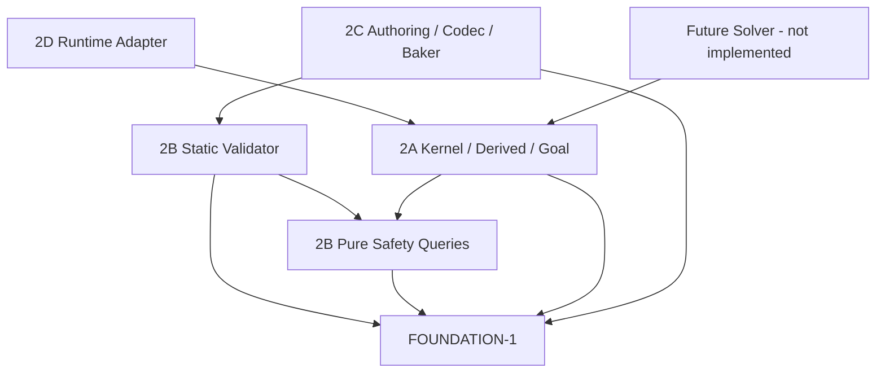

# FOUNDATION-2.0 — Puzzle Rule Kernel Contract Freeze

## 1. Purpose、优先级与真实基线

本文件冻结第二波执行合同，不是实现验收。第一波实际实现与通过基线为 `f04f00989be427049c78faf6a739253470412b3f`，分支 `feat/foundation-core`。架构 §33 三决策及 `2026-09-13-foundation-core-contracts.md` 的既有 ABI 优先；本文件只补充其未实现的执行边界。历史 Spec 的“未实现”描述对应当时阶段；第一波现状以 FOUNDATION_INTEGRATION_REPORT 为准。

执行合同独立标记 `foundation.execution.v1`，不向 LevelDefinition/PuzzleState 增加版本字段。既有数据标签保持 `1 / foundation.contract.v1 / cube24.v1 / foundation.rules.v1`；LevelDefinition 19字段、PuzzleState六字段、statekey.v1 字节格式及八种动作的字段均不变。新增执行结果/上下文只在内存调用边界存在。第二波若需改变这些数据字段，必须返回中央合同评审，不能局部升级或绕过 DATA。

方案取舍：采用纯函数生成完整下一态、Runtime 独立持有单事务的方案。把动画 busy 放入 PuzzleState 会破坏 statekey.v1；让 Runtime 自己合并玩家与全局字段会产生第二套规则。这两种方案均不采用。

## 2. Kernel Responsibilities / 唯一执行所有者

Kernel 验证语义动作、编排正式空间/光照查询、形成完整原子下一态、处理机关效果和目标查询。Runtime 与未来 Solver/Replay 调用同一入口。Kernel 不使用 Node、SceneTree、Timer、帧率、随机数、相机、输入键值、动画、音频、GPU 或物理服务器。

现有真实接口（路径均相对项目根）：

| Owner / 文件 | 必须消费的接口 |
|---|---|
| orientation/discrete_orientation.gd | `is_valid`, `columns`, `from_columns`, `compose`, `inverse`, `apply`, `quarter_turn`, `reframe`；唯一24态数学 |
| contracts/contract_records.gd | `make_action(kind,payload)`, `initial_state(level)`；工厂不是业务授权 |
| contracts/contract_validation.gd | `validate_level_shape`, `validate_state_shape`, `validate_action_shape`，各返回 Array[ValidationIssue] |
| contracts/state_key.gd | `build(level,state) -> {ok,key,issues}`；完整String比较 |
| spatial/surface_geometry.gd | `snapshot(level,state) -> {ok,value,issues}`；`face_id`, `face_frame`, `resolve_anchor` 等仍由Spatial拥有 |
| spatial/spatial_validation.gd | `validate_snapshot(snapshot_result,faces)`；接包装，不接裸值 |
| spatial/mapping_query.gd | `collect_mapping_candidates` 内部正式调用 discovery/classification；再 `resolve_mapping` |
| celestial/celestial_rules.gd | `resolve_slot_request(definition,current_slot_id,operation,target_slot_id,alternate_slot_id)` |
| celestial/logical_lighting.gd | `query(anchor,slot,cubes)`；只接成功快照的裸值记录 |

以上为已实现接口。后文 `foundation/rules`、`foundation/validation`、`foundation/level`、`foundation/runtime` 是拟实现路径，本轮不会创建脚本。第一波测试 fixture 仅证明 shape/数学集成，不能直接宣称满足第二波完整安全与机制 profile。

## 3. 顶层 API 与 Atomic Transition

全部静态函数，Dictionary 按下述封闭 schema，字段键 String、ID StringName、枚举 int，输入与输出不共享可变集合。

| 拟实现文件 / 别名 | 唯一签名及返回 |
|---|---|
| `foundation/rules/puzzle_rule_kernel.gd` / Kernel | `evaluate_action(level: Dictionary, state: Dictionary, action: Dictionary, context: Dictionary) -> Dictionary`：PuzzleTransitionResult |
| 同上 | `complete_global(level: Dictionary, state: Dictionary, context: Dictionary) -> Dictionary`：PuzzleTransitionResult；完成已授权事务，不接受新动作 |
| `foundation/rules/rule_records.gd` / RuleRecords | `idle_context() -> Dictionary`；`begin_global(level: Dictionary, result: Dictionary) -> Dictionary`：ContextResult |
| `foundation/rules/goal_evaluator.gd` / Goal | `is_goal(level: Dictionary, state: Dictionary) -> Dictionary`：GoalResult |

只有 `evaluate_action` 负责“查询是否可执行+若可执行计算下一态”。不另写 can_move/can_shift/apply 的独立判断器；UI预览调用同一入口，丢弃结果即可。APPLIED 意味着推导成功，**不表示函数已修改调用者状态**。调用者只在检查 APPLIED 后把整份 next_state 作为唯一状态引用替换；不逐字段 patch。

PuzzleTransitionResult 固定字段：

| 字段 | 类型 / 含义 |
|---|---|
| status | `TransitionStatus`，APPLIED=0 / REJECTED=1 / ERROR=2；仅由拟实现 `rules/rule_types.gd` 定义 |
| previous_state | Dictionary；输入 state 的深复制，ERROR 时可为原始无效输入副本，不冒充已验证状态 |
| next_state | Dictionary 或 null；仅 APPLIED 时为完整合法六字段状态 |
| action | Dictionary；输入动作深复制；complete_global 返回原先 accepted_action |
| changed | bool；APPLIED 且新旧完整状态不等才true；其余false |
| rejection_code | int；仅 REJECTED 为非0 ActionRejectionCode，APPLIED/ERROR 固定0 |
| issues | Array[ValidationIssue]；APPLIED=[]；ERROR至少一条ERROR；REJECTED可携带下层诊断 |
| global_kind | 既有 GlobalTransitionKind；非全局或无变化为NONE；失败为NONE |

执行顺序固定：DATA level/state/action/context shape → 旧稳定空间与玩家安全 → Busy 许可 → 动作源/授权 → 动作特有查询 → 深复制构造完整候选 → 机关组合与安全/光源可计算检查 → DATA下一态检查 → 生成成功结果。每阶段失败即停止后续阶段；同阶段 issues 按 core §8 排序。SHIFT 的几何歧义优先于 Shadow/blocked，Busy admission 优先于动作几何；不能用 busy 隐藏坏 shape/坏当前空间。

不修改旧状态、定义或 context；任意失败 next_state=null。即使已在局部临时副本上换玩家，再出现1105，也必须丢弃整个候选。APPLIED.changed=false 可用于 SET当前Slot；不启动动画事务，不生成 Solver 自环。对输出副本修改不得影响输入或其它字段副本。

## 4. PuzzleAction Semantics / canonical union

继续使用 `Types.PuzzleActionKind` 原编号0..7；需求中的 ROTATE_LOCAL_GROUP 唯一映射到既有 **LOCAL_GROUP_ROTATE=6**，不增加别名或第九动作。W/A/S/D/Q/E/Tab/Space/MouseDrag 都不是动作值。

| kind / payload（除kind） | source、必要状态与合法条件 | 成功可变字段 / 常见拒绝 |
|---|---|---|
| MOVE / face_axis | InputMapper或未来Solver，当前可站立Face，离散邻接与路径安全 | player；若IDLE进入ENTER机关可组成一次事务；MOVE_BLOCKED |
| SHIFT_WORLD / 无 | 当前玩家Face，目标必须正式Mapping唯一，§6权限 | player；NO_SHIFT_MAPPING、1403/1404/1405 |
| ROTATE_SURFACE / rotation_delta | 基础世界能力，目标固定SURFACE，允许delta/端态与安全 | world_orientations[0]，承载时player.orientation；ROTATION_NOT_ALLOWED/ROTATION_STATE_INVALID |
| ROTATE_INNER / rotation_delta | 同上，目标固定INNER，不依赖PlayerLayer/UI选择 | world_orientations[1]，承载时player.orientation；同上 |
| USE_FACE_TRANSITION / transition_id | 玩家位于source，flags满足，同层已声明路径可用 | player；FACE_TRANSITION_NOT_AVAILABLE |
| TRIGGER_MECHANISM / mechanism_id | 玩家在该Face，trigger=USE；ENTER只能由合法进入事件内部触发 | 按定义action的单一效果，不能任意写state；UNAUTHORIZED_MECHANISM |
| LOCAL_GROUP_ROTATE / group_id,rotation_delta,mechanism_id | 必须匹配本Face的USE机制动作，或内部ENTER授权；组有有向边 | group_orientations[id]，承载时player.orientation；旋转/授权拒绝 |
| MOVE_CELESTIAL / celestial_op,target_slot_id,alternate_slot_id,mechanism_id | 相同机制授权；调用正式Slot请求 | 唯一celestial.slot_id；SLOT_STEP_UNAVAILABLE/授权拒绝 |

shape合法只是入门，绝不授权远程机关。直接组/天体动作必须逐字段等于绑定机制 action，不能只知道一个mechanism_id就任意修改目标。机制的ENTER内部授权不是公开payload字段；不可伪造。各动作不改表中未列状态字段。默认机制状态和flags的写入范围见§12，不能以任意Dictionary效果扩充。

## 5. MOVE / Connectivity

face_axis沿**当前源Face的Shared Space Frame**解释：U_POS→u、V_POS→v、U_NEG→-u、V_NEG→-v。输入 mapper 的 nearest axis 指四个几何方向，不能遇障碍后自动改选可走方向；相机退化或量化不确定时 adapter 拒绝，不调用Kernel。

ConnectivityResolver 唯一在 `rules/connectivity_resolver.gd`，`query_move(level,state,face_axis) -> ConnectivityResult`，记录 `{ok, target_location, direction, issues}`。ok=true时target_location可null（无邻接）、direction为源切向单位Vector3i；失败两者null。形状与快照错误保留issues；正常无邻接issues=[]。

从真实snapshot寻找同层、walkable、同Shared normal，且 target.position2 = source.position2 + 2*d 的面；用提升后的int64分量比较，不先做Vector3i加减。需唯一目标，空间损坏/多目标为ERROR，不排序取首。多目标诊断用已有INVALID_FACE=1103。落点净空、移动扫掠由§16共享Safety查询确认。没有目标或安全不能证明时 MOVE_BLOCKED，旧态不动。

roll_axis = normal × d，是有符号单位轴；通过正式 `quarter_turn(axis,sign)` 取delta，再 `compose(delta,old_pose)`。不在Kernel复制24表。目的Face允许local face编号不同，但必须满足同层共面同法线；普通MOVE不绕同Cube边缘。相邻Face自身u/v不同不额外扭玩家姿态。四次同向roll及正反roll都应恢复对应数学关系。

## 6. SHIFT_WORLD / ShiftPermission

派生成功后调用 `collect_mapping_candidates(snapshot,faces,source_id,other_layer,level.shift_compatibilities)` 再 `resolve_mapping`。前者已编排正式Discovery与Classification，不重复实现筛选或先按光照删候选。

| Mapping结果 | Kernel结果 |
|---|---|
| NONE | REJECTED，rejection_code=NO_SHIFT_MAPPING=1400，保留原issues |
| UNIQUE | 继续完整权限与目标安全检查 |
| AMBIGUOUS | ERROR，rejection_code=0，原1401 issues含全部候选；无next_state |
| ERROR | ERROR，完整保留下层code/severity/path/entity_ids/details；不继续Lighting |

UNIQUE后确定性顺序：source.shift_exit_blocked → target.shift_entry_blocked → 若源Surface则查询源光照要求SHADOW → 目标玩家安全。Surface→Inner要求以上全部及IDLE；Inner→Surface不查询Shadow许可、不要求SHADOW，但仍检查目标安全/当前数据有效。Lighting.ok=false为ERROR，绝不当SHADOW。GlobalTransition!=IDLE时SHIFT一律REJECTED，无queue。

成功位置采用mapping.target_face对应的本地cube_id/face/layer。SAME_NORMAL保持旧Shared Space pose，即使target的u/v不同也不对齐。OPPOSITE_NORMAL将两个完整frame经 `from_columns(u,v,normal)` 得到合法ID，调用 `reframe(source_id,target_id,old_pose)`；公式等于TargetFrame×inverse(SourceFrame)×OldPose。固定golden：3→2、pose0结果1；3→17、pose0结果19。不能固定180°轴。Frame仍派生，不写入state。

## 7. World Rotation / PlayerLayer ≠ RotateTarget

rotation_delta必须是既有六个±90°ID且在目标World.allowed_rotation_deltas，target=compose(delta,current)必须在allowed_states。allowed_rotation_intents是Runtime可见的输入意图名单，Kernel只接delta，不读取Camera；Baker/Validator要求World两个名单同时为空或同时非空。配置delta是规则授权全集，intent是表现入口，Solver只使用delta；不能以隐藏相机缩小或扩大规则图。

World delta在Shared Space左乘，pivot采用定义的Shared pivot2。玩家在目标世界时，PlayerLocation本地身份保持，pose=compose(delta,old_pose)；否则player全字段不变。世界内所有Group/Cube的位置和Frame都由正式snapshot从定义重算。目标配置或扫掠安全不成立→ROTATION_STATE_INVALID；已坏定义/非法声明/底层溢出→ERROR。

World rotate是基础能力，Group rotate是有机关授权的局部事务，不能互相调用UI目标去推测。RotateTarget永远不进state/key。Target的可用轴由允许delta集合表示，不另加RotationAxis字段。

## 8. FaceTransition / 有界首版路径

当前schema只有source/target、entry_axis/exit_axis、rotation_steps、required_flags，没有任意pivot/轨道控制点。第二波冻结**同一Cube外表面的显式旋转通道profile**：两端为同层同cube不同可站立Face，rotation_steps非空；跨Cube任意轨道留后续schema扩展。不能把缺少的路径数据藏在tags、build_info或ID字符串中。

每个step是源Cube本地坐标中的±90°。逐步左乘得到累计D，要求每步将当前面法线转到另一个六面法线，不能只是沿法线原地自转。固定路径为三段装置运输：玩家中心2从cube.center2+2*n沿n外移至cube.center2+4*n；绕Cube解析中心旋转该90°并同步pose；沿目标负normal回收至cube.center2+2*n_next。平移不改pose。若C为该Cube的Shared orientation，每步Shared delta = C×step×inverse(C)，调用正式compose/inverse/apply；点变换由共享Safety的checked运动查询生成，不复制Spatial层级解析。通道提供这段显式运动的支撑，不是新增普通跳跃动作；中间位置不进入PuzzleState。

累计终点必须等于声明target的真实Anchor/normal；累计变换作用于source entry方向必须等于target exit方向。两axis用于校验路径方向，不是模拟键值。玩家姿态按每个Shared delta左乘，绝不回正或用目标默认Frame覆盖。路径中间可途经未walkable的面，因其是显式支撑通道；必须证明整段净空。反向需要独立transition记录及逆序逆step。

USE只在source且required_flags全true时可用，busy时拒绝。不额外要求mechanism_id：现有动作没有这个字段；如果配置中由机关触发，机制action只能引用既有USE_FACE_TRANSITION，仍走同一Kernel。旧结构validator接受的更宽记录不等于第二波业务profile有效；2B应明确INVALID_ROTATION_EDGE/INVALID_REFERENCE拒绝，不静默退化为传送。

## 9. RotatableGroup Transaction

目标组来自group_id及mechanism授权，current来自state.group_orientations。delta在父World坐标左乘，target=compose(delta,current)；必须在allowed_states、allowed_rotation_deltas，且有完全匹配from/delta/to的RotationEdge。pivot2在未旋转父World坐标；解析严格沿第一波W×G×C。

玩家本地cube_id属于组时跟随，location身份不变，Shared delta=W×delta×inverse(W)，pose左乘该delta；不属于组则player不变。派生Frame/位置随snapshot更新。完整目标快照、该组与其他同层实体、玩家端态及扫掠均需安全。拒绝时组和玩家均不变。声明非法目标/组归属是静态ERROR；合法域内当前边不可用为ROTATION_NOT_ALLOWED；安全不能证明为ROTATION_STATE_INVALID。不得部分转组后补救玩家。

## 10. Celestial Transaction

SET_SLOT目标必填alternate空；NEXT/PREVIOUS两个ID都空；TOGGLE_BETWEEN两个合法不同ID，当前必须属于两端。调用正式Celestial.resolve_slot_request，不重写slot_order/wrap/edges；成功candidate.next_slot_id只写唯一state.celestial.slot_id。

合法Slot图中边不存在/不环绕越界/当前不在toggle两端→REJECTED SLOT_STEP_UNAVAILABLE=1301，保留原诊断；错误类型、缺引用1300、计算异常→ERROR。目标Slot下相关世界光照必须可计算；不能把LIGHT_SOURCE_INVALID变SHADOW。设置当前Slot→APPLIED.changed=false，不创建全局事务。

Solver直接消费完整next_state。Runtime在视觉到达前仍使用旧已提交Slot A，保存已获授权的事务；到达B且本地roll落定后调用complete_global，整份更新后的状态一次提交。不得把启动时的player副本覆盖最新位置。没有连续Slot或动画进度的Solver节点。

## 11. Global Busy / Kernel与Scheduler的界线

继续使用现有GlobalTransitionState、GlobalTransitionKind，不定义第二套busy枚举。ExecutionContext固定 `{global_transition_state: int, ticket: Dictionary|null, local_moves: Array[Dictionary]}`。IDLE时ticket=null、local_moves=[]；MOVING/TRANSITION时ticket必须为成功事务记录。

GlobalTicket固定 `{level_hash: String, base_state: Dictionary, accepted_action: Dictionary}`。它只保存一次已接受的全局动作与原稳定输入，不含待执行新动作。`begin_global(level,result)`只做DATA/Result shape、APPLIED、changed=true、global_kind非NONE及可开ticket动作种类检查，返回ContextResult `{ok,context,issues}`；成功context=MOVING+ticket+空local_moves，失败context=null。ticket不是安全凭证；Kernel每次消费时必须在IDLE上下文重算base_state/accepted_action的原始结果，确认真实授权成功及level_hash一致，再处理trace。RuleRecords不反向preload Kernel，避免Kernel→工厂→Kernel循环依赖。transaction_id/generation/动画对象由Runtime另存，不能塞入ticket或PuzzleState。

`local_moves`只记录**已执行并提交的普通MOVE**，用于确定性重放/交换性证明，不是queue。只允许MOVE及其原payload，无时间/输入键。每次消费context验证从ticket.base_state重放这些局部移动的结果等于当前state；篡改或不符→ERROR INVALID_ACTION。Runtime不能直接修改target字段或授权“安全区域”。

ticket首版只允许原动作是纯global或USE触发的单global：MOVE+ENTER复合动作不能开ticket，begin_global返回失败INVALID_ACTION。此复合动作在本地roll落定时完整提交player与global效果，随后只做不影响规则/准入的视觉反馈；不会出现“已站上板但旧Slot仍等待另一次提交”的半态。所有延迟global ticket期间的MOVE必须没有ENTER副作用。此政策保留统一原子规则，避免对复合MOVE保存base/trace时重复移动。

busy时除可证明交换且安全的普通MOVE外，SHIFT、两World Rotate、Group Rotate、Celestial、FaceTransition、TRIGGER全部REJECTED GLOBAL_TRANSITION_BUSY=1500，立即丢弃，无补触发标记。Reset取消ticket/local_moves并递增Runtime generation；所有旧回调忽略。没有 pending_actions。

### 11.1 可交换MOVE的有限证明

证明由2A的 `rules/transition_permission.gd` 统一实现，供Kernel调用；Runtime不能自己判断。

1. 按旧已提交状态求MOVE及原已授权事务候选；再在两种次序求完整终态。事务权限使用原接受上下文，不因玩家走离console而撤销，但目标空间/安全需复验。
2. 将旧MOVE的Shared切向按载体delta映射到新源Frame，匹配唯一±u/±v以生成规范MOVE；使用正式Math。天体或非承载旋转时delta=identity。跨不同运动载体边界不能证明相同变换则拒绝。
3. 两条路径所有端态/扫掠必须安全，最后完整StateKey相等；不能只比较位置忽略pose。还必须调用共享Safety.validate_concurrent_motion证明global进度×roll进度的整个组合扫掠安全；串行扫掠安全不等于同时运动安全。入场机制、flags/Goal副作用或取决于动画时序的动作不许可。保守首版拒绝进入任何ENTER机制Face及进入/离开goal Face的busy MOVE，不让被丢弃的触发造成Solver与Runtime轨迹差异。
4. 无法证明→REJECTED MOVE_NOT_COMMUTATIVE=1504；正常缺邻接仍MOVE_BLOCKED。错误包装/1105→ERROR。不是整体禁止WASD：必须有天体运动中、承载World/Group运动中安全同载体MOVE的正例。

`complete_global`核对ticket和已提交local_moves，在最新player状态上由Kernel重新形成完整事务终态；结果等于“原全局原子动作→已证明的规范MOVE序列”。不得由Runtime逐字段merge、再次触发机关或重新执行被拒动作。失败不提交并取消动画提交路径，保留最后已提交状态/明确错误；不能在failed completion时回写旧player。正常过程中已证明不变量应保证完成成功。

APPLIED MOVE提交后，Runtime才把该动作追加local_moves。busy产生的查询结果不创建第二个ticket。完成时清空context；视觉到达等待一次已在进行的roll落定不构成queue新全局动作。

## 12. Mechanism Trigger / 不扩展万能效果脚本

继续使用原MechanismDefinition七字段。ENTER表示一次从不同Face进入该Face的边缘事件，USE表示显式交互；Reset/spawn/视觉回调/站立不生成ENTER。同Face重复USE是新显式请求，但仍检查授权、busy及目标图。无RELEASE、Timer、周期扫描或延迟补触发。

Mechanism.action为现有PuzzleAction。首版允许绑定MOVE_CELESTIAL、LOCAL_GROUP_ROTATE、USE_FACE_TRANSITION；不允许递归TRIGGER、MOVE、SHIFT或WorldRotate，避免隐藏多全局链。静态不合profile→INVALID_ACTION。定义名/皮肤可表现为pressure plate/button/console；逻辑只看ENTER/USE。

普通IDLE MOVE进入后，按(priority升序, mechanism_id字节升序)收集ENTER效果；一次动作最多一个global effect，多于一个→ERROR MULTIPLE_GLOBAL_MUTATIONS=1501，整次MOVE不提交，不能挑第一个。唯一效果若拒绝，外层MOVE也REJECTED并保持原位；若出错整个ERROR。成功MOVE及效果构成一个完整next_state。已是全局动作的SHIFT/FaceTransition不再链入ENTER效果；若目标有ENTER机制，首版静态profile拒绝该组合（INVALID_ACTION），避免两种入场语义或隐藏第二事务。

直接TRIGGER与直接受授权组/天体动作共用同一效果分派，不复制算法。机关action带的mechanism_id必须等于自身ID；Face.mechanism_ids与definition.face_id互相吻合。首版mechanism_states完整保留且要求每个机制 `allowed_states=[initial_state]`，不把任意off/on词当可猜的FSM。占用从PlayerLocation派生，不额外持久化。

**Flag change的当前边界：** 已有八动作没有SET_FLAG，MechanismDefinition也没有flag target/value或状态转换表。本轮不伪造它已支持。level_flags仍完整保留用于Goal/FaceTransition条件，初值来自FlagDefinition；首版无动作写入flags。需要可变flag/门/多状态机关时先单独扩展动作/定义合同，再由单一Owner修改DATA，禁止塞入action额外字段、tags/build_info或根据ID猜效果。2A–2D的首版验收不要求该延伸能力；不会借本轮修改生产代码。

## 13. DerivedStateResolver / 缓存边界

`rules/derived_state_resolver.gd` 拟接口：`snapshot(level,state) -> SpatialQueryResult`（转调正式Geometry及Validation）；`shift_mapping(level,state) -> MappingResolutionResult`；`light(level,state,face_id: StringName) -> LightQueryResult`。玩家当前face由正式face_id解析，Slot由同一state.celestial.slot_id查定义。

Connectivity、Frame、Lighting、AnchorOverlap、ShiftMapping、PlayerSafety均为派生。上游失败立即返回原issue，禁止Lighting继续吃null/包装/部分值。Kernel编排查询不等于复制几何算法。结构快照生成成功仍须validate_snapshot，不能只检查snapshot.ok。

首版纯静态API不保存全局可变cache。后续可在一次调用内或调用者独立cache保存成功snapshot/light/mapping/connectivity/safety；key至少包含完整level内容身份、StateKey和查询参数（face_axis/face_id/目标action/完整busy ticket及trace如适用）。StateKey不包含busy，所以busy许可缓存不能仅用StateKey。只凭作者伪造content_hash或String.hash短整数不可命中；记录不可变内容或完整canonical内容比对。结果深复制，清cache不得改变行为。Camera/Visual无法从PuzzleState推导，也不是此Resolver职责。

## 14. GoalEvaluator / Solver Boundary

`Goal.is_goal(level,state) -> {ok: bool, is_goal: bool|null, issues: Array[ValidationIssue]}`。shape及玩家位置/安全有效后，仅比较当前正式FaceNodeId==goal.face_id且所有required_flags值true。未满足→ok=true,is_goal=false；坏引用/坏状态→ok=false,is_goal=null。绝不切世界、改flags、触发机关或设置PuzzleComplete持久字段。

Runtime只在IDLE稳定边界展示目标完成；busy许可不得依赖隐藏目标计时。未来Solver每条边调用Kernel.evaluate_action(...,RuleRecords.idle_context())，只加入APPLIED.changed=true的完整next_state，用唯一StateKey.build；Goal同一个入口。Solver搜索、动作生成器、BFS/A*/可达性/Softlock均未实现，不把静态全构型枚举冒充Solver。

## 15. Rejection vs Error / canonical codes

ValidationIssue仍使用第一波Types.ValidationCode，不增加第二套ValidationCode；其中历史1400–1504包含查询/动作诊断，不能因本轮概念分层而重编号。**status决定结果类别，issue.severity不能独自决定动作是REJECTED还是ERROR**。例如Mapping.NONE带1400 ERROR级诊断，但Kernel可以明确REJECTED；AMBIGUOUS必须ERROR。

ActionRejectionCode是rejection_code的封闭值域：既有码直接使用Types.ValidationCode原名原值；四个尚无同义码的动作拒绝由拟 `rules/rule_types.gd` 的 `ActionRejectionCode` 枚举唯一新增2000..2003。该枚举只定义新增四项，不重复注册既有1400等；2000段禁止放进ValidationIssue.code，因为第一波包装validator不接受它。0表示无拒绝，ERROR使用issues解释。

| 需求语义 | canonical rejection_code / 状态 |
|---|---|
| MOVE_BLOCKED | 新MOVE_BLOCKED=2000，REJECTED |
| SHIFT_NO_MAPPING | 既有NO_SHIFT_MAPPING=1400，REJECTED，不创建别名 |
| SHIFT_AMBIGUOUS_MAPPING | ERROR + 既有AMBIGUOUS_SHIFT_MAPPING=1401 issue，rejection_code=0 |
| SHIFT_SOURCE_EXIT_BLOCKED | 既有SHIFT_EXIT_BLOCKED=1404，REJECTED |
| SHIFT_TARGET_ENTRY_BLOCKED | 既有SHIFT_ENTRY_BLOCKED=1405，REJECTED |
| SHIFT_REQUIRES_SHADOW | 既有SHIFT_REQUIRES_SHADOW=1403，REJECTED |
| GLOBAL_TRANSITION_BUSY | 既有GLOBAL_TRANSITION_BUSY=1500，REJECTED |
| ROTATION_NOT_ALLOWED | 新ROTATION_NOT_ALLOWED=2001，REJECTED |
| ROTATION_STATE_INVALID | 新ROTATION_STATE_INVALID=2002，REJECTED；可附PLAYER_UNSAFE等原诊断 |
| FACE_TRANSITION_NOT_AVAILABLE | 新FACE_TRANSITION_NOT_AVAILABLE=2003，REJECTED |
| MECHANISM_NOT_TRIGGERABLE | 既有UNAUTHORIZED_MECHANISM=1503，REJECTED |
| CELESTIAL_ACTION_NOT_ALLOWED | 既有SLOT_STEP_UNAVAILABLE=1301，REJECTED |
| busy局部MOVE不能证明可交换 | 既有MOVE_NOT_COMMUTATIVE=1504，REJECTED |

未知动作字段、无效ID/引用、错误上下文、非法声明→ERROR（1000–1007/1101/1502等）；坏当前状态→ERROR，不称MOVE_BLOCKED。目标不在allowed域/边缺失是合法动作不允许；定义宣称的允许端态本身坏是静态ERROR，Kernel防御检查也ERROR。保守扫掠未获安全证明时动作REJECTED，静态Validator给INCOMPLETE。所有1105永远ERROR并原样传播；不能包装成2002而丢掉底层错误。

## 16. Static Validator Boundary / 唯一共享安全查询

2B拥有 `foundation/validation/static_validator.gd`，接口 `validate(level: Dictionary, options: Dictionary) -> StaticValidationResult`。options固定 `{max_configurations: int, max_checks: int}`，正整数，默认调用示例4096/100000；以计数预算，不使用墙钟决定逻辑结论。

结果固定 `{status, issues, configurations_checked, checks_performed}`；`ValidationStatus`唯一在2B的validation_types.gd：VALID=0 / INVALID=1 / INCOMPLETE=2。INVALID表示已证明错误；预算不够1600、保守安全不能证明1601→INCOMPLETE；两者同时出现INVALID优先，仍保留incomplete诊断。仅VALID允许Bake。它不是LEVEL_SOLVABLE证明。

静态枚举world allowed_states笛卡尔积×各group allowed_states×各Slot，按layer/group_id与数值/ID稳定顺序；不按玩家可达性剪枝，不BFS。验证所有配置完整Spatial、可计算Lighting、walkable面/Goal支撑、所有源Face的Mapping歧义、所有声明旋转边。坏Spawn只在初始配置检查其声明pose/location；其它状态按各walkableFace放置规范安全探针，不假定Spawn一直在原空间。预算按尝试构型和查询计数，不能截断后VALID。

至少覆盖Duplicate ID、Cube overlap、Invalid Face/Orientation/Group/Celestial/Mechanism、Spawn、Goal、歧义、Player Unsafe After Rotation、1105。名字与细分码完全沿用core §8.1，无INVALID_EXIT等自造笼统别名。没有映射1400通常合法，不是关卡无效；光照不影响歧义。

**共享Safety Owner=2B**，`foundation/validation/safety_queries.gd`：

- `validate_state(level: Dictionary,state: Dictionary) -> Dictionary`：SafetyResult。
- `validate_motion(level: Dictionary,before: Dictionary,after: Dictionary,action: Dictionary) -> Dictionary`：SafetyResult。
- `validate_concurrent_motion(level: Dictionary,before: Dictionary,after_local: Dictionary,after_global: Dictionary,local_action: Dictionary,global_action: Dictionary) -> Dictionary`：SafetyResult；before为当前旧全局态，after_local和after_global分别是已校验的单动作候选。
- SafetyResult固定 `{status,issues}`，`SafetyStatus`在validation_types.gd定义SAFE=0 / UNSAFE=1 / UNPROVEN=2 / ERROR=3。UNSAFE已有PLAYER_UNSAFE/结构code；UNPROVEN为1601；ERROR保留坏输入/1105。SAFE要求issues=[]。

Safety只做几何/支撑/净空/扫掠，不判Shadow、busy、机制权限、允许动作或Goal，不调用Kernel。静态Validator和Kernel共用它，禁止各写第二套玩家体积/扫掠判断。新增依赖明确为2A→2B的纯Safety接口；**不是2A调用完整StaticValidator，也不是2B实现运行规则**。此细节由真实第一波只有单快照结构检查的边界导出；不能声称2A单靠第一波已具备PlayerSafety。

### 16.1 首版安全证明范围

玩家为边长L的立方体，稳定中心2=支撑anchor.position2+normal；轴对齐24态稳定体积center2±1，同层实体开内部不得相交，支撑面接触允许；跨层实体不参与碰撞。所有derived坐标先int64计算与范围检查，不能调用Math.apply处理超int32临时向量。

连续运动不采动画帧。使用保守整数扫掠包围证明，范围不足返回UNPROVEN而非随意放行：绕有符号主轴的pivot旋转，对每个运动体取两垂直分量到pivot的最大绝对角点距离rx/ry，以R=rx+ry包住整个四分圆；轴向使用原角点区间。checked int64构造包围域，任何危险运算先验范围。同一刚性载体成员之间保持相对位置，免内部重复碰撞；对静止实体逐个检查。

并发查询在玩家属于旋转载体时，先在载体未旋转坐标中包住完整局部roll体积，再对该整个包围域求global旋转包围体，覆盖两进度所有组合，与同层静止障碍检查。玩家不属于正在旋转的同层Group时，玩家完整roll包围域保持Shared坐标，和Group完整扫掠域作分离证明；不能把组外玩家跟组旋转。旋转另一世界或仅天体运动不改变玩家同层实体运动，退化为普通roll安全。玩家相对载体roll需先验证源/目标支撑及周边载体成员，不可把玩家视作始终刚性固定后全部豁免。任何组合包围体接触可能碰撞但不能确证分离→UNPROVEN。回归例：y轴90°组，支撑center2=(4,0,0),(6,0,0)，障碍center2=(4,4,4)，玩家TOP沿+x roll；即使两种串行轨迹安全，未经组合扫掠证明不能许可并发。不读取当前动画角度以放宽许可。

普通roll使用真实支撑边pivot=source.anchor+d，玩家以该边90°旋转；支撑源/目标两Cube只豁免已证明共面等高的接触关系，其他Cube仍需扫掠检查。FaceTransition使用§8的外移/旋转/回收三段轨道，三段分别检查周边实体；外移/回收仅接触支撑端面，旋转时中心半格径向距离4，玩家与支撑体在旋转平面的最大半径之和2√2<4，可用整数平方比较证明分离。禁止在原径向距离2直接旋转后豁免支撑Cube，该路径会在中间角度穿透。World整体刚性旋转不与另一层碰撞；Group对其层其它Cube及非承载玩家检查。保守包围重叠并非证明碰撞，返回UNPROVEN；真实端态穿透为UNSAFE。有明确无障碍的合法正例、有端态安全但扫掠无法证明的负例，禁止只验终点。

## 17. Baker Boundary / canonical LevelDefinition

2C拥有 `foundation/level/level_codec.gd`：`encode(level: Dictionary) -> Dictionary`，`decode(text: String) -> Dictionary`，`compute_content_hash(level: Dictionary) -> Dictionary`。编码返回 `{ok,text,issues}`，解码 `{ok,level,issues}`，hash `{ok,content_hash,issues}`；失败payload分别空String/null/空String。已有state_key.gd不改，不能复制StateKey算法成第二入口。

Level JSON沿core §6：UTF-8无BOM/末尾LF/结构空白，字段按Unicode码点排序；ID文本、枚举符号、Vector3i三整数数组。worlds按layer；cubes/faces/groups/slots/mechanisms/face_transitions/flags按完整ID；rotation edges按from/delta/to、slot edges按from/to；ID集合如cube_ids/mechanism_ids/required_flags/tags按ID排序；有语义顺序的slot_order/rotation_steps以及Orientation/intent/delta数组保留声明顺序。重复项先拒绝，不靠排序去重。字符串转义与core §6.2一致，但不调用私有StateKey编码器。hash=排除content_hash/build_info后上述规范JSON字节的SHA-256小写64hex；不是整个文件带元数据的摘要。

`foundation/level/level_baker.gd::bake(authoring: Dictionary, options: Dictionary) -> Dictionary`，返回 `{ok,level,issues,validation}`；失败level=null，validation为StaticValidationResult或null（还未进入验证）；成功issues=[]、validation.status=VALID。authoring是canonical level字段的预输入：省略content_hash，由Baker计算，其余18字段齐全、整数坐标/枚举内存格式；不会让用户手填hash。先shape检查可用内部占位hash，量化/编码/hash/真实StaticValidator全部成功后才输出最终level。纯bake不写盘；命令行入口仅成功后写指定E盘输出，不覆盖既有文件。

`foundation/level/authoring_reader.gd::read_scene(root: Node3D) -> Dictionary`，返回 `{ok,authoring,issues}`；这是唯一Godot authoring边界。最小scene用明确导出字段/稳定ID，根为Shared Space；由根逆变换归一化，按core §3.1的1e-6容差/半格规则检查，半值远离零，先范围后Vector3i。不静默吸附/接受缩放剪切镜像，不从Node显示名或兄弟顺序猜ID。Cube的Faces由正式make_face_nodes生成，再套明确作者walkable/限制/机制配置，不手放Anchor。

第一版无Editor Plugin/Face Edit Mode/Overlay/Heatmap。2C测试的Validator double只能存在tests/foundation/level；最终bake成功必须接真实2B VALID。codec可独立并行；没有Validator实现时不能报完整Baker PASS。

## 18. Runtime Adapter Boundary

2D拥有 `foundation/runtime/input_mapper.gd`、`kernel_port.gd`、`runtime_session.gd`、`prototype_presenter.gd` 和独立prototype scene。InputMapper把屏幕输入量化为现有face_axis/rotation_delta；RotationIntent观察基C及正负方向严格沿core §2，不传Camera对象到Kernel。

`input_mapper.gd::map_move(frame: Dictionary, camera_basis: Basis, screen_direction: Vector2) -> Dictionary`、`map_rotation(intent: int, camera_basis: Basis, world: Dictionary) -> Dictionary` 返回 `{ok,action,issues}`；失败action=null，无法确定轴用既有INVALID_ACTION诊断，仅属adapter错误。MOVE相反输入必须成对取反。为使架构§6的平局序与该要求同时确定执行，先规范化方向符号：屏幕向量首个非零分量(x后y)为正时为代表，负时取反为代表；只对代表投影按+u,+v,-u,-v打破平局，再按原符号还原相反轴。不分别对正负向量应用平局表。投影零/近退化拒绝；rotation只接匹配签名单位轴的离散观察基，禁从连续角度猜world轴。

`kernel_port.gd`只转发Kernel上述同名三个参数/四参数接口及Goal，不能实现if-shadow/邻接/姿态/Slot分支。`runtime_session.gd`拟 `load_level(level: Dictionary) -> Dictionary`、`request_action(action: Dictionary) -> Dictionary`、`finish_global(transaction_id: int,generation: int) -> Dictionary`、`reset() -> void`。前两者分别返回 `{ok,issues}`、PuzzleTransitionResult；finish返回 `{ignored:bool,transition:Dictionary|null}`，旧token则ignored=true且无状态变化。同步成功global应用完整result.next_state，动画式global保存ticket且延后complete，均不由视觉节点写规则字段。

本地roll同样只在落定提交完整局部next_state，期间输入mapper不积压动作；global期间许可MOVE走Kernel。Presenter读取状态和ticket做视觉插值，Reset递增generation并取消Tween/回调；旧callback不能覆盖新开局。project.godot/F5入口不改，以独立scene启动技术原型。

最大Surface 2–3 Cube、Inner 2–3 Cube，一个Shadow Shift、一个允许Rotate；不要求正式美术/P-02。至少有错误反馈（拒绝码→可读文案）与Reset，并能用稳定StateKey对照同动作纯Kernel回放。

## 19. Ownership与第二波并发依赖

四Work只能修改自身下面的目录、专属plan和report。新增脚本的对应.uid同Owner；不生成全局class_name。同一公共文件不分给两个Work。

| Work | production所有权 | tests / scene所有权 | 专属report |
|---|---|---|---|
| 2A | foundation/rules/ | tests/foundation/rules/ | FOUNDATION_RULE_KERNEL_REPORT.md |
| 2B | foundation/validation/ | tests/foundation/validation/ | FOUNDATION_STATIC_VALIDATOR_REPORT.md |
| 2C | foundation/level/ | tests/foundation/level/；tools/foundation/level/ | FOUNDATION_LEVEL_BAKER_PROTOTYPE_REPORT.md |
| 2D | foundation/runtime/ | tests/foundation/runtime/；prototype/foundation/runtime/ | FOUNDATION_RUNTIME_PROTOTYPE_REPORT.md |

精确文件见四计划。第一波十个生产脚本、其tests与wrapper、两份基础Spec、本Spec、其它Work计划/report、game/、原prototype/、production资产、tests/visual、project.godot均只读。需要超出名单时报告中央合同问题，不能借shared helper任意修改其它Owner。

2A/2B基础均依赖FOUNDATION-1；为了避免重复PlayerSafety，2A真实联调额外依赖2B的冻结Safety接口。2B没有对Kernel反向依赖。2A可用测试目录中的Safety double先做动作编排单元测试，2B可独立实现安全/静态检查，2C依赖冻结Validator接口，2D依赖冻结Kernel接口；所有double只允许测试，不能放production目录充当真实Owner。最终真实集成次序：2B Safety→2A真实规则；2B完整Validator→2C真实Bake；2A→2D真实Runtime。并行启动≠所有模块可同时取得最终PASS。

## 20. Testing、验收与明确延期

每份plan必须含RED→最小实现→GREEN、输入深复制、反例、错误码、真实依赖gate、验收命令和专属PASS。不写复制实现的“测试数学”；固定golden加正式Math调用。新增测试失败不得改已冻结合同求绿。单元double PASS与真实集成PASS分别报告。

2A必须验证八动作、原子失败、SAME/OPPOSITE、1105传播、busy正负例/规范串行等价/无deferred、Goal只读；2B覆盖完整声明域与预算；2C量化/稳定编码/hash/真实Validator；2D真实输入→Kernel→完整state→visual/Reset、与纯回放StateKey一致，并回归旧P-01。

本轮验收仅文档：现有接口核对、名称/字段/码无冲突、所有权不相交、四计划可执行、Obsidian保留旧正文、只文档差异、HEAD不变。没有本轮Godot/Runtime或实现测试PASS声明。全部自检后输出FOUNDATION_RULE_KERNEL_CONTRACT_FREEZE_PASS，停止等待review，不commit/push/merge，不自动启动Work。

明确延期：动态flag/门/多状态机制schema扩展、跨Cube任意FaceTransition轨道、精确任意连续扫掠、PuzzleIntent/Goal AST、ActionGenerator/Solver/BFS/A*/Softlock/Ablation、Editor Plugin、正式资源/Blender、P-02、P-01迁移。任何超保守安全范围不能证明的构型明确UNPROVEN/INCOMPLETE，不当通过。本轮冻结这些边界，不表示全部目标架构能力已实现。
