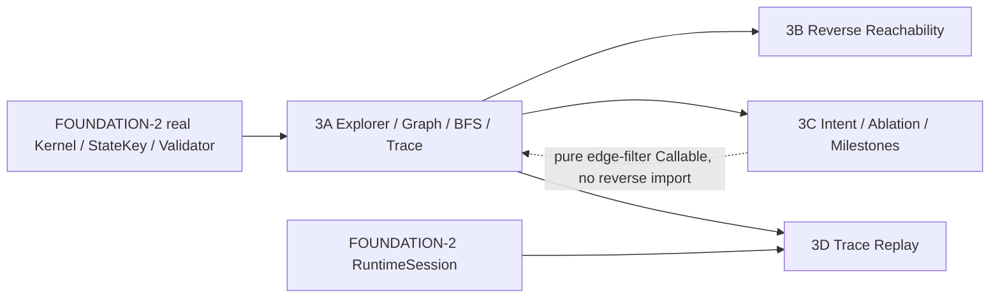

# FOUNDATION-3.0 — Solver & Quality Contract Freeze

## 1. Purpose与真实基线

本轮仅冻结第三波合同/计划，不实现Solver。主仓库分支feat/foundation-core，开始HEAD为4dda1fdce9c562427ab7541f1ee21266a3b8214a，工作区干净。FOUNDATION-2报告的FOUNDATION_RULE_RUNTIME_PASS是既有验收，本轮不重跑或冒称新的Runtime通过。

优先级：原core contracts与架构§33、执行合同foundation.execution.v1定义玩法；本文件foundation.analysis.v1定义其上的搜索/分析/回放。LevelDefinition十九字段、PuzzleState六字段、八种PuzzleAction、statekey.v1、cube24.v1均不变。PuzzleIntent是独立sidecar，不能塞进LevelDefinition或build_info当隐藏规则。

采用“唯一探索器生成有向多重图，质量模块消费同一图/求解接口，回放消费语义trace”的方案。首版完整图和第一个最短解是两种明确的停止策略；不能用一个模糊finished标志同时表示找到解与穷尽全图。

## 2. Solver Architecture / 已有真实接口

下表来自实际生产代码，不是旧计划推测。以下脚本全部只读。

| 已实现Owner | 当前接口 / 消费边界 |
|---|---|
| rules/puzzle_rule_kernel.gd | static `evaluate_action(level,state,action,context)`；返回八字段PuzzleTransitionResult，APPLIED=0/REJECTED=1/ERROR=2 |
| rules/rule_records.gd | static `idle_context()`；原子Solver每次使用它，不开ticket、不complete_global |
| rules/goal_evaluator.gd | static `is_goal(level,state)->{ok,is_goal,issues}`；包括真实Safety，不能自行player==exit |
| contracts/state_key.gd | static `build(level,state)->{ok,key,issues}`，唯一完整String身份 |
| contracts/contract_records.gd | static `make_action(kind,payload)`、`initial_state(level)`；Reset目标为后者 |
| validation/static_validator.gd | static `validate(level,{max_configurations,max_checks})`；VALID=0/INVALID=1/INCOMPLETE=2 |
| level/level_codec.gd | static `compute_content_hash(level)`、`encode(level)`；encode拒绝假hash，statekey本身不核hash真实性 |
| rules/connectivity_resolver.gd | static `query_move(level,state,face_axis)`；只在3C追溯已成功MOVE入场效果时复用，不由Generator裁边 |
| rules/mechanism_effects.gd | static `enter_effects(level,source_face,target_face)`、`authorize(...)`；分类只复用前者，合法性仍Kernel |
| rules/derived_state_resolver.gd | static `light(level,state,face_id)`等；里程碑查询复用，不复制光照 |
| runtime/runtime_session.gd | instance `load_level(definition)`、`request_action(action)`、`finish_local(id,generation)`、`finish_global(id,generation)`、`reset()`；有committed/transition_started/feedback信号 |
| runtime/kernel_port.gd | 默认正式Kernel/Records/Goal，只有显式测试注入，无生产double fallback |

RuntimeSession.load_level只装载Records.initial_state(level)，没有任意state恢复API；3D首版只回放从该spawn初态出发的trace，不能直接赋session.state绕过限制。探索器可以从其它合法稳定态开始，但这些trace的Runtime replay明确返回不支持初态ERROR。

依赖原则：3A只依赖FOUNDATION-2。3B消费3A StateGraph；3C消费3A Solver并拥有唯一Mechanic分类器；3D消费3A Trace及真实Runtime。3A以冻结的纯过滤Callable接收3C的消融策略，不反向preload 3C，无模块循环。过滤器只删已获Kernel许可的边，不能生成或修改next_state。

## 3. 顶层接口与Owner

所有Dictionary是封闭schema，未知字段拒绝；ID StringName、状态键String、枚举int。除3D异步Node driver外为纯记录/RefCounted static函数。分析不修改输入、返回集合深复制。新类型只由各Owner的types脚本定义，无重复class_name。

| 拟实现路径 / 别名 | 唯一公共签名 |
|---|---|
| solver/action_generator.gd / Actions | `generate(level: Dictionary,state: Dictionary) -> Dictionary`：ActionGenerationResult |
| solver/state_explorer.gd / Explorer | `explore(level: Dictionary,initial: Dictionary,policy: Dictionary,budget: Dictionary) -> Dictionary`：SolverResult |
| solver/bfs_solver.gd / Solver | `solve(level: Dictionary,initial: Dictionary,policy: Dictionary,budget: Dictionary) -> Dictionary`：同一SolverResult；薄调用Explorer，不能另有BFS |
| solver/search_records.gd / SearchRecords | `default_policy(mode: int) -> Dictionary`；`default_budget() -> Dictionary` |
| solver/state_graph.gd / Graph | `validate(level: Dictionary,graph: Dictionary) -> Dictionary`：`{ok,issues}`，结构/身份一致性检查 |
| solver/solution_trace.gd / Trace | `from_graph(level: Dictionary,graph: Dictionary,goal_key: String) -> Dictionary`：`{ok,trace,issues}`；`validate(level: Dictionary,trace: Dictionary) -> Dictionary`：`{ok,issues}`；`validate_semantics(level: Dictionary,trace: Dictionary) -> Dictionary`：`{ok,transitions,issues}` |
| quality/softlock/softlock_analyzer.gd / Softlocks | `analyze(level: Dictionary,graph: Dictionary,budget: Dictionary) -> Dictionary`：SoftlockAnalysisResult |
| quality/intent/mechanic_classifier.gd / Mechanics | `classify_transition(level: Dictionary,result: Dictionary) -> Dictionary`：MechanicClassificationResult |
| quality/intent/intent_validation.gd / IntentValidation | `validate(level: Dictionary,intent: Dictionary) -> Dictionary`：`{ok,issues}` |
| quality/intent/ablation_analyzer.gd / Ablation | `analyze(level: Dictionary,initial: Dictionary,intent: Dictionary,policy: Dictionary,budget: Dictionary) -> Dictionary`：IntentAnalysisResult |
| quality/intent/milestone_analyzer.gd / Milestones | `analyze_trace(level: Dictionary,intent: Dictionary,trace: Dictionary) -> Dictionary`：MilestoneAnalysisResult |
| parity/trace_replayer.gd / Replayer | instance async `replay(level: Dictionary,trace: Dictionary,options: Dictionary) -> Dictionary`：RuntimeParityResult，调用者await |

Solver/Graph/Trace/预算/分析公共问题码由3A拥有。3B/3C/3D不能重建图或trace schema、重写StateExplorer/BFS或StateKey。

## 4. ActionGenerator：静态域与动态合法性

ActionGenerationResult=`{ok: bool, actions: Array[Dictionary], issues: Array[AnalysisIssue]}`；失败actions=[]。先DATA结构验证；只枚举以下静态域，不检查Mapping/Shadow/净空/当前组边/Goal/busy。

| canonical kind | 候选域 |
|---|---|
| MOVE=0 | face_axis=0,1,2,3，每态都可尝试 |
| SHIFT_WORLD=1 | 唯一无payload候选 |
| ROTATE_SURFACE=2 / ROTATE_INNER=3 | 对各World.allowed_rotation_deltas排序去掉同一动作的重复；定义重复仍由Validator拒绝，不能修关卡 |
| USE_FACE_TRANSITION=4 | 全部已声明transition_id，按完整ID序；不自行查source/flags |
| TRIGGER_MECHANISM=5 | 全部trigger=USE的mechanism_id；ENTER不生成显式USE请求 |
| LOCAL_GROUP_ROTATE=6 / MOVE_CELESTIAL=7 | 全部USE机制绑定的对应action原值深复制；不擅自枚举另一组、delta或Slot参数 |

ENTRY效果随普通MOVE由Kernel原子执行，Generator不能单独排入ENTER动作。直接绑定动作与TRIGGER wrapper都保留：它们是已有不同语义输入，可能产生相同下一态，图允许平行边。本版不偷偷合并它们或把action kind重命名为ROTATE_LOCAL_GROUP。

所有动作先按kind数值，再按其字段次序比较：MOVE face_axis；Rotate rotation_delta；Face transition_id；Trigger mechanism_id；Group group_id,rotation_delta,mechanism_id；Celestial celestial_op,target_slot_id,alternate_slot_id,mechanism_id。数字按数值、ID按Unicode码点；键插入顺序不影响结果。只去重完全相同payload。此排序用于固定BFS第一条最短trace，不是新的PuzzleState身份。

## 5. StateExplorer：完整边的唯一来源

每个候选都调用正式Kernel.evaluate_action(level,state,action,RuleRecords.idle_context())。REJECTED记录计数且不生边；ERROR立刻终止为Solver ERROR并保留完整上游issues；APPLIED.changed=false计no_op且不生自环；APPLIED.changed=true才核对完整next_state并调用正式StateKey/Goal。

候选预算不够时不调用Kernel。容量不足时不插入半个节点或只写一侧邻接；在全部next_state、key、Goal、filter、预算成功后一次加入node/edge/forward/reverse/predecessor。所有next_state只来自Kernel，Graph或filter不能改它。

Safety UNPROVEN被Kernel转换为REJECTED时照常拒边，记录其中1601诊断的计数；Solver不直接调用低层几何“再试一次”。若在StaticValidator阶段未获VALID则根本不探索。所有完整结论都相对于当前fail-safe Kernel语义，并不证明放宽安全模型后的物理谜题无解。

## 6. StateKey / StateGraph唯一结构

StateKey.build成功的完整String是唯一节点身份；空key/失败不能入visited。Camera、RotateTarget、Animation、Light/Mapping cache、Debug/UI、busy ticket仍不在statekey.v1。Dictionary内部hash可加速，不能代替完整字符串相等比较。

StateGraph字段固定：`graph_version="stategraph.v1"`, `level_hash: String`, `rule_version: String`, `initial_key: String`, `policy_descriptor: Dictionary`, `nodes: Dictionary[String,GraphNode]`, `edges: Array[GraphEdge]`, `forward: Dictionary[String,Array[int]]`, `reverse: Dictionary[String,Array[int]]`, `complete: bool`, `stop_reason: GraphStopReason`。

GraphNode=`{state_key: String,state: Dictionary,depth: int,is_goal: bool,expanded: bool,predecessor_edge: int|null}`。state是拥有的完整六字段副本；depth为BFS首次发现的最短距离。初始depth0/predecessor=null，其余首个发现边作为唯一重建predecessor，不因后续同距边覆盖。

GraphEdge=`{edge_id: int,from_key: String,to_key: String,action: Dictionary,global_kind: int}`；edge_id是edges下标，从0递增，只是边引用，绝非状态身份。全图每个node在forward/reverse都有条目，空邻接也保留。每条边两侧索引恰好出现一次。边必须来自完整成功有变化且通过filter的Kernel结果；同源不同action到同目标均保留。同源同action不重复评估建边。

Goal为终止节点：发现时is_goal=true、expanded=true、forward=[]，不继续探索离开Goal的动作。所有质量结论相对于“到Goal结束”的图；不把通关后探索算softlock。普通节点只有完整尝试候选域后expanded=true；途中预算/ERROR节点保留false。

Graph.validate检查版本/字段/引用、节点完整key重算、depth与predecessor、双向邻接、终点Goal、完整标记与expanded/stop一致。它不能仅凭字典证明未遗漏玩法边：**complete只信任本进程正式Explorer刚产生的图**。首版不导入外部Graph文件/用户自制图；持久化重新加载须重新探索，不能给手填complete盖证明章。3B测试的手构造图仅为算法单元fixture，最终必须接真实Explorer图。

## 7. SearchPolicy与无循环的消融过滤

SearchPolicy固定 `{strategy: StringName, mode: SearchMode, validation_options: Dictionary, filter_descriptor: Dictionary, transition_filter: Callable}`。strategy仅&"BFS"；其它返回ERROR，不假装已有A*。SearchMode：FIRST_SHORTEST=0、FULL_GRAPH=1，由3A solver_types定义。

validation_options沿真实2B `{max_configurations:int,max_checks:int}`。filter_descriptor固定 `{filter_id:StringName, filter_version:String, disabled_mechanics:Array[int]}`。默认 `&"UNFILTERED" / "1" / []`，transition_filter为空Callable；消融 `&"MECHANIC_ABLATION" / "1" / 非空唯一升序tags`，Callable必须有效，具体tag校验由3C负责。无其它filter_id，无任意脚本路径/字符串eval。Graph/Trace只保存descriptor，不保存Callable或Node。

过滤回调签名 `(level: Dictionary, result: Dictionary) -> {ok:bool,allow:bool,issues:Array[AnalysisIssue]}`，只接APPLIED.changed=true的深复制记录。allow=false删整个原子边；ok=false→Solver ERROR。不得改输入、生成状态、吞掉Kernel ERROR、拆掉MOVE的ENTER效果后留下另一种MOVE。3A不实现MechanicTag映射；3C提供唯一分类器与回调。未安装/失效callback不按UNFILTERED继续。

PolicyDescriptor唯一封闭结构为`{strategy:StringName,mode:int,validation_options:Dictionary,filter_descriptor:Dictionary}`。它是SearchPolicy删除transition_filter后的深复制投影，字段值及嵌套schema完全沿上文；禁止仅保存filter或添加预算字段。Graph和Trace的policy_descriptor必须完全相同。判断未消融图唯一使用`policy_descriptor.filter_descriptor.filter_id == &"UNFILTERED"`且disabled_mechanics为空；缓存匹配全部四字段。预算是此次调用的执行限制，在结果报告保存，不改变准许边的策略身份。descriptor不证明Callable实际行为；3A负责准确保留，3C负责验证自己提供的filter语义。

公开solve/explore的每次调用都校验Level/hash/StaticValidator；消融不修改Level或机制定义，因此原Validator仍针对同一Level。图的complete是“对该descriptor的所有准许边穷尽”，不能拿禁用边的完整图宣称原始关卡无解。

## 8. SearchBudget / 前置验证

SearchBudget固定五字段：`max_states:int>0`, `max_edges:int>=0`, `max_depth:int>=-1`, `max_runtime_ms:int>=0`, `max_action_evaluations:int>0`。-1只用于无限深度；runtime_ms=0明确关闭墙钟预算，其余值均启用。默认10000 / 100000 / -1 / 0 / 200000；默认policy验证预算4096构型/100000检查。0边预算仍允许初态就是Goal。

先核输入shape→Codec.encode验证真实content_hash→StaticValidator.validate→DATA初态/Goal/StateKey。INVALID→ERROR INVALID_LEVEL；Validator INCOMPLETE→ERROR LEVEL_VALIDATION_INCOMPLETE，upstream保留1600/1601，没有搜索图、不能PROVEN_UNSOLVABLE。SearchBudget墙钟覆盖整个调用包括preflight；独立的Validator计数预算不冒充搜索已完成。初态可以不同spawn但必须是正式合法稳定态。

max_states包含初态与发现尚未展开的节点；max_edges只限制已纳入图的成功边；max_action_evaluations计所有Kernel尝试包括拒绝/无变化/过滤删除，避免大量拒绝绕过边预算。每项操作前判断容量，不能先超过再回滚。

max_depth不静默裁图：depth=D的节点仍检查候选；若成功边去已知节点可记录，若将发现depth=D+1新节点则BUDGET_EXCEEDED/MAX_DEPTH，不声称闭包。所有候选本就拒绝/回到visited时，可正常穷尽。上限恰好用满但没有待容纳新项不算耗尽。

墙钟采用单调计时；在每个外部纯调用前后、每个候选前和报告返回前检查。不能中断一次Kernel/Validator内部调用，因此不是硬实时上限；超过则返回BUDGET_EXCEEDED/MAX_RUNTIME_MS，不晚报SOLVED。一次已调用函数若返回ERROR，ERROR优先，保留异常而非遮为超时。runtime_ms>0的截断位置可随机器负载变化，固定计数预算及禁用墙钟才承诺相同图/第一解；elapsed_ms不进StateKey或规则。

## 9. SolverStatus与完整性

3A唯一枚举SolverStatus：SOLVED=0、PROVEN_UNSOLVABLE=1、BUDGET_EXCEEDED=2、ERROR=3。BudgetReason：NONE=0、MAX_STATES=1、MAX_EDGES=2、MAX_DEPTH=3、MAX_RUNTIME_MS=4、MAX_ACTION_EVALUATIONS=5。GraphStopReason：EXHAUSTED=0、FIRST_GOAL=1、BUDGET=2、ERROR=3。

| 终止条件 | status / graph.complete |
|---|---|
| FIRST_SHORTEST发现第一个Goal，未超预算 | SOLVED / 通常false；初态Goal是单终止节点闭包，可true |
| FULL_GRAPH队列穷尽，有至少一个Goal | SOLVED / true |
| 任意模式完整穷尽，无Goal | PROVEN_UNSOLVABLE / true |
| 有尚需执行/容纳的工作但预算不允许 | BUDGET_EXCEEDED / false，已找到trace可保留，但不是SOLVED |
| Kernel/Goal/StateKey/数据/图/filter异常 | ERROR / false；preflight失败graph=null |

预算耗尽即使此前发现Goal仍BUDGET_EXCEEDED；已有trace只是有效见证，不代表完成请求。不能把空trace同时表示无解和未完成。

## 10. BFS、Goal与predecessor

只在visited首次插入时入FIFO队列；普通节点按候选固定序展开。Goal以正式GoalEvaluator识别，不复制退出规则。边成本统一1个semantic action；MOVE+ENTER是单原子边，包含两个机制不变成两步；动画秒数/按键数不计。

在检查新节点与Goal成功并完整入图后，FIRST_SHORTEST可返回第一Goal；FIFO+单位成本证明其步数最短。FULL_GRAPH继续直到所有非Goal节点展开完，以首个发现Goal重建一条确定的最短trace。从Goal沿predecessor_edge回到initial_key，反转动作/结果序列；发现断链、环或depth不一致→ERROR GRAPH_INVALID，禁止返回部分解。

Reset不属于候选域，不能为了避免死局自动放入边。所有Solver调用使用IDLE，不模拟MOVING中间帧；并发等价由已完成第二波Kernel负责，不在搜索中另造时间窗路线。

## 11. SolverResult与Search Metrics

SolverResult固定 `{status, graph, solution_trace, metrics, budget_reason, issues, validation}`。graph为StateGraph或null；solution_trace为SolutionTrace或null；validation为真实StaticValidationResult或未调用时null；issues为AnalysisIssue数组。SOLVED必有trace；PROVEN_UNSOLVABLE必graph.complete且trace=null；ERROR可保留此前有效prefix图/trace作为诊断，但不得称成功。预算reason只在BUDGET_EXCEEDED非NONE。

SearchMetrics固定：

| 字段 | 精确含义 |
|---|---|
| explored_states | expanded=true的节点数，含已确认终止Goal；不是仅出队次数 |
| visited_states | 已入nodes数量，含初态/前沿 |
| generated_edges | 已原子记录的edges数量，含平行边/指向已访问节点的边 |
| duplicate_states | 记录的成功边中目标入边前已经visited的数量 |
| goal_states | 已发现不同Goal key数量 |
| max_depth_reached | 已入节点的最大BFS depth；尚无节点时0；不因被预算拦下的候选递增 |
| solution_length | 有trace为total_actions，否则null |
| action_evaluations / rejected_actions / no_op_actions / filtered_edges | Kernel实际调用数 / REJECTED数 / APPLIED无变化数 / filter删除成功有变化数 |
| safety_unproven_rejections | REJECTED且issues含1601的动作数，不绕开也不改判 |
| elapsed_ms | 单调计时的实际观测耗时，仅性能数据 |
| shortest_solution_count / shortest_solution_count_complete | 首版固定null / false；明确延期，不写1代替真实数量 |

“max_depth”需求语义在输出唯一拼写max_depth_reached，SearchBudget.max_depth是限制，二者不建立第二套指标。average/max branching factor首版延期，避免对半展开节点给错误平均。计数不能作为玩法正确性输入；发生计数表示溢出明确ERROR，不能wrap。

## 12. SolutionTrace / 唯一基础生成

3A拥有schema与基础生成；3D只验证/消费/回放，不建第二格式。Trace字段固定 `trace_version="solutiontrace.v1"`, `level_hash`, `rule_version`, `policy_descriptor`, `initial_state`, `initial_statekey`, `steps`, `goal_statekey`, `total_actions`, `shortest`。

step固定 `{index:int, action:Dictionary, expected_state:Dictionary, resulting_statekey:String, global_kind:int}`；index从1连续递增。完整expected_state用于差异定位，其唯一身份必须等于正式StateKey.build。initial_statekey同理。total_actions=steps.size，goal_statekey为末步key或零步时initial_key。正式Goal查询末态必须true。shortest只有正式BFS已证明时true；人工fixture不能冒充证明。

Trace.validate检查封闭字段、版本、level/hash、DATA动作/状态、所有key重算、长度/索引/末态Goal，不独自证明动作之间可达；真正语义有效性通过3D Runtime replay或3A产生时的Kernel证据。数据不含Keyboard/鼠标/帧时间/Node；不得用trace标签改变规则。图的predecessor初始状态可非spawn，3D支持边界见§26。

Trace.validate_semantics先调用validate，再从initial_state开始顺序调用正式Kernel.evaluate_action与idle_context，逐步要求APPLIED.changed=true、next_state及StateKey/global_kind与step完全一致；终点再使用正式Goal。返回`transitions:Array[PuzzleTransitionResult]`与steps一一对应，失败时transitions=[]并保留错误；零步Goal返回空数组成功。它不搜索、不判断最短性、不证明filter符合descriptor；3C复用此唯一入口并用自己的分类器检查消融tag。3C产生任何硬质量finding之前必须完成该语义验证，不能把正确key但不可达的伪造trace作为违规见证。3D仍需真实Runtime逐步提交，不能用此纯Kernel检查替代Runtime验收。

## 13. Reset Policy

Primary action set没有RESET，也没有隐式回到初态的边。Runtime回放开始时可load_level准备会话，测试可单独Reset，但它们不是trace.steps或求解成本。`RECOVERABLE_BY_RESET`仅为Softlock附加分类，永远不从softlock集合扣除。

## 14. Softlock Definition / Reverse Reachability

在同一未过滤、Goal终止的完整图中：ReachableFromInitial为所有nodes；CanReachGoal为从全部Goal沿reverse边访问的集合，包含Goal自己；Softlock=ReachableFromInitial−CanReachGoal。没有任何Goal且图完整时所有可达节点均为softlock，同时initial已证明无解，报告区分全局无解与局部死局。

3B只在已有图做reverse遍历，不生成PuzzleAction、不调用自己的BFS探索玩法。全图节点已由3A从初态发现，不另造图。为softlock见证可沿图已有predecessor重建“到该状态”的prefix；它不是SolutionTrace（末态未必Goal），用GraphPath=`{target_key,edge_ids:Array[int]}`，不冒充通关解。

## 15. SoftlockAnalysisResult与不完整图

3B新增SoftlockStatus：COMPLETE=0、INCOMPLETE=1、ERROR=2。AnalysisBudget=`{max_nodes:int>0,max_edges:int>=0,max_runtime_ms:int>=0}`，默认10000/100000/0。计数上限约束本次接纳的不同图节点/边记录，验证与reverse遍历复用同一记录不重复计数；nodes_checked/edges_checked分别为已经完整验证的不同记录数，不是循环次数。结构粗检后若图总记录数超上限，返回INCOMPLETE、计数0、goal_reachable_states=[]，不调用无预算的Graph.validate；在限额内才完整验证并按图大小计数、随后reverse。所有验证/遍历时间纳入墙钟，原子调用前后检查，不能硬中断Graph.validate。墙钟超限INCOMPLETE，已发现的ERROR优先。图验证错误或graph.stop_reason=ERROR→ERROR；只接受UNFILTERED descriptor，消融图不能代表原关卡softlock。

结果固定 `{status, initial_key, reachable_states, goal_reachable_states, softlock_states, softlock_count, unknown_states, reset_classification, reset_recoverable_count, witnesses, metrics, issues}`。集合为完整StateKey字符串升序数组；metrics=`{nodes_checked,edges_checked,elapsed_ms}`。

完整合法图且分析穷尽时softlock_states为确定差集、softlock_count精确整数、unknown_states=[]。graph.complete=false或分析预算不足时：status=INCOMPLETE，**softlock_states=null、softlock_count=null**；只列已证实可达的节点/已证实能到Goal的节点，unknown_states为其余已知节点，不称softlock。可以保留已证实到Goal的正向事实，不能用未发现反向路径证明无路径。

ResetClassification：RECOVERABLE_BY_RESET=0、NOT_RECOVERABLE_BY_RESET=1、UNKNOWN=2。从Records.initial_state(level)取spawn key：若它在图且已证实能到Goal，确定softlock节点均可Reset恢复；若完整图包含spawn且spawn不能到Goal，则不可恢复；若spawn不在以自定义初态探索的图、图/分析不完整，则UNKNOWN。reset_recoverable_count仅在COMPLETE且分类确定时分别为softlock_count或0，否则null。没有softlock时COMPLETE count=0；分类仍按spawn证据，不能伪造负结论。

## 16. PuzzleIntent sidecar / 不改变LevelDefinition

3C拥有最小封闭记录：`intent_version="puzzleintent.v1"`, `intent_id:StringName`, `level_hash:String`, `rule_version:String`, `required_mechanics:Array[int]`, `optional_mechanics:Array[int]`, `expected_milestones:Array[MilestoneDefinition]`, `forbidden_bypasses:Array[BypassDefinition]`。

ID沿core小写标识；Level hash/rule必须匹配。required/optional各唯一且互不重叠，机制tag按数值排序；milestones保持作者顺序、ID唯一。无任意Goal AST、字符串脚本或UI文案谓词。intent改变不改变PuzzleState身份，但每份质量报告保留完整intent副本以表明分析要求，不能只写Level hash掩盖不同意图。

BypassDefinition=`{bypass_id:StringName, disabled_mechanics:Array[int]}`，非空唯一排序集合，表示“设计禁止在完全不用这些机制时仍能通关”；允许单tag或集合，不能把禁用多个tag的结果错误归到单个tag必要性。重叠测试可以复用同集合运行结果，但报告对应所有声明ID。

## 17. MechanicTag唯一taxonomy

3C `quality/intent/intent_types.gd`唯一枚举：MOVE=0、WORLD_SHIFT=1、SURFACE_ROTATE=2、INNER_ROTATE=3、FACE_TRANSITION=4、LOCAL_GROUP_ROTATE=5、CELESTIAL_CHANGE=6、MECHANISM_TRIGGER=7。这是分析tag，不是第二套PuzzleActionKind或其数值别名。

| 成功动作 / 实际效果 | tag |
|---|---|
| MOVE | MOVE；若触发ENTER另包含MECHANISM_TRIGGER与实际效果tag |
| SHIFT_WORLD | WORLD_SHIFT |
| ROTATE_SURFACE / ROTATE_INNER | SURFACE_ROTATE / INNER_ROTATE |
| USE_FACE_TRANSITION | FACE_TRANSITION |
| TRIGGER_MECHANISM | MECHANISM_TRIGGER + 所绑定且实际发生的效果tag |
| LOCAL_GROUP_ROTATE | MECHANISM_TRIGGER + LOCAL_GROUP_ROTATE |
| MOVE_CELESTIAL | MECHANISM_TRIGGER + CELESTIAL_CHANGE（实际slot变化时） |

MechanicClassificationResult=`{ok,tags:Array[int],mechanism_ids:Array[StringName],issues:Array[AnalysisIssue]}`，tags/IDs唯一排序。只分类已经成功的真实结果，不裁定合法性。REJECTED/ERROR或不一致结果是分类输入错误；APPLIED无变化返回空集合，不计机制使用。MOVE+ENTER中设置当前Slot时MOVE有变化，可计MECHANISM_TRIGGER，但不计CELESTIAL_CHANGE。

结果没有effects事件列表，不能编造已有events字段。3C对已成功MOVE复用正式Connectivity.query_move定位**中间入场Face**，再调用正式Effects.enter_effects。不能只看最终player.location：ENTER可能绑定FaceTransition，玩家已离开踏板面。USE/direct绑定从定义找mechanism_id；既有profile保证单效果且不递归。根据正式效果种类与结果slot/group等实际差异归tag；不重算roll、Mapping或Lighting。分类结果与结果记录矛盾→ERROR，不猜漏掉效果。

## 18. Mechanic Ablation / 原子删边

analyze只接受UNFILTERED输入policy，否则ERROR/INVALID_SEARCH_POLICY；先用该policy正常solve获得SOLVED，才开始required/optional/forbidden集合的消融。baseline BUDGET/ERROR→分别INCOMPLETE/ERROR；PROVEN_UNSOLVABLE→BASELINE_UNSOLVABLE，不讨论机制essential。

3C提供transition_filter，在3A调用Kernel得到APPLIED.changed=true后分类；tags与禁用集合相交则allow=false，删**整个原子边**。MOVE→ENTER天体、TRIGGER→天体、直接MOVE_CELESTIAL入口均被同一CELESTIAL_CHANGE捕获。不能仅删顶层kind，也不能删除ENTER效果后保留移动下一态；那是另一个玩法模型。

每个ablation仍通过正式Solver调用，不复制BFS。不修改Level或Kernel，不绕过Safety。callback错误即ERROR，不能把错误视为“此边被禁用”。通过filtered Solver返回的trace每步仍是原Kernel合法边，可送原Runtime回放；policy_descriptor必须保留消融scope。

## 19. AblationResult / Bypass

3C枚举AblationStatus：COMPLETE=0、INCOMPLETE=1、ERROR=2、BASELINE_UNSOLVABLE=3。AblationResult固定 `{status, disabled_mechanics, baseline_status, ablated_status, essential, bypass_detected, findings, solution_trace_if_any, metrics, issues}`。单机制字段需求在本版统一为disabled_mechanics集合，禁止另有混淆单tag字段。

baseline SOLVED后：

- ablated SOLVED→essential=false；若禁用单tag是required或该集合是forbidden_bypasses，bypass_detected=true，finding=MECHANIC_BYPASS；optional只说明非必要，不报硬错误。
- ablated PROVEN_UNSOLVABLE→essential=true（对这一集合整体；不能推出集合每个成员各自必要），bypass_detected=false。
- ablated BUDGET_EXCEEDED→INCOMPLETE，essential=null、bypass_detected=null。即使partial trace存在也只作为证据附件，不把这次未完成请求改成完整判定。
- ablated ERROR→ERROR，二值结论均null；保留upstream。

metrics固定`{baseline:SearchMetrics,ablated:SearchMetrics|null}`；findings为QualityFinding数组。每次search使用独立SearchBudget与结果，不能混加后伪称同一次探索。首版分析没有总墙钟保证；测试数量受intent有限集合约束，每个子结果单独保留。任何硬bypass finding产生前复用Trace.validate_semantics，消融见证额外以唯一classifier确认不含禁用tag；不满足即ERROR，不制造质量定论。

analyze是同步的有限批次，首版没有公开取消参数或异步进度信号；调用方若在外部中断进程，只能保留未完成执行记录，不能伪造已返回的IntentAnalysisResult。正常返回时按所有实际子结果聚合完整性。

IntentAnalysisResult固定 `{status, intent, baseline, ablations, milestone_analysis, advisories, issues}`；status沿AblationStatus。COMPLETE仅表示请求的消融与trace检查均完成，不是LEVEL_INTENT_PASS、无其它解/无软锁证明。任何子项ERROR优先，其次INCOMPLETE；baseline无解单列。

## 20. Milestones / 首版证据范围

MilestoneDefinition=`{milestone_id:StringName, required:bool, predicate:Dictionary}`。最小PredicateKind唯一在intent_types：AT_FACE=0(payload face_id)、IN_LAYER=1(layer)、FACE_LIGHT=2(light_state)、MECHANIC_USED=3(mechanic)、GOAL=4(无payload)。各记录只含kind及该分支字段；FACE_LIGHT查询该采样状态玩家Face的正式Derived.light，失败ERROR，不当阴影。不得输入UI文字REACH_SHADOW当脚本表达式。

先调用Trace.validate_semantics；失败返回ERROR且findings=[]。采样0为初态，随后每个trace step为“该入口返回的真实transition经唯一分类器得到的tag集合+提交后的完整状态”；初态没有action/tag。MECHANIC_USED仅当步成立，不是曾经使用的永久事实。GOAL用正式Goal。required=true的子序列按作者顺序贪心匹配，索引允许非递减：同一原子MOVE+ENTER可同时满足两个谓词。optional条目独立记录最早命中与顺序建议，不阻塞required子序列，不因缺一个optional把后面required误报缺失。

MilestoneStatus：TRACE_MATCH=0、TRACE_BYPASS=1、INCOMPLETE=2、ERROR=3。结果 `{status, scope:"SINGLE_TRACE", matched_milestones, missing_required, sample_indices, findings, issues}`，sample_indices为milestone_id→int|null，未匹配为null。完整合法Goal trace跳过required子序列→TRACE_BYPASS与MILESTONE_BYPASS，是一条真实违规见证；全部匹配只表示TRACE_MATCH，不能证明其它解也遵循顺序。

严格的“所有解都满足里程碑”需要完整图×有限进度自动机的乘积分析。首版明确延期此普遍性证明；不由3C再写BFS，不只查首个最短解就给全关意图PASS。报告必须保留SINGLE_TRACE scope，不能将IntentAnalysisResult.COMPLETE解释为所有解的教学顺序已验证。

## 21. UNUSED_MECHANISM与Multiple Solutions

首版只针对实际返回trace给UNUSED_MECHANISM advisory，记录mechanism_id、required/optional tag、scope="RETURNED_SHORTEST_TRACE"、observed_used=false；“这一条最短见证未使用”不等于“所有最短解/所有解无用”。若当前只有预算截断trace，scope="DISCOVERED_WITNESS"，不宣称完整最短解集合。

多个Goal/同长路径/平行动作边都允许。首版返回确定的一条最短解，不计算shortest_solution_count；指标明确null/false。未来计数需最短距离DAG、平行动作序列定义和整数溢出策略，另行版本化扩展；不能把visited去重后的Goal数量当解数量。

## 22. AnalysisIssue / QualityFinding / 错误边界

不能向第一波ValidationCode偷偷加入搜索码。3A `solver_types.gd`唯一AnalysisCode：INVALID_LEVEL=3000、INVALID_INITIAL_STATE=3001、INVALID_SEARCH_POLICY=3002、INVALID_SEARCH_BUDGET=3003、KERNEL_ERROR=3004、GOAL_ERROR=3005、STATEKEY_ERROR=3006、GRAPH_INVALID=3007、TRACE_INVALID=3008、FILTER_ERROR=3009、VERSION_MISMATCH=3010、LEVEL_VALIDATION_INCOMPLETE=3011、ANALYSIS_OVERFLOW=3012、REPLAY_INITIAL_UNSUPPORTED=3013、RUNTIME_ERROR=3014、RUNTIME_SOLVER_DIVERGENCE=3015、ANALYSIS_INPUT_INVALID=3016。

AnalysisIssue固定 `{code:int,severity:Types.ValidationSeverity,path:String,message:String,details:Dictionary,upstream:Array[ValidationIssue]}`。upstream原样深复制保留原code/path/实体/details，尤其1105；AnalysisIssue绝不送旧DATA/Spatial结果包装validator。预算为显式status+budget_reason，不用ERROR issue冒充无解。

3C QualityCode：MECHANIC_BYPASS=4000、MILESTONE_BYPASS=4001、UNUSED_MECHANISM=4002。QualityFinding=`{code:int,severity:int,subject_ids:Array[StringName],scope:StringName,trace:Dictionary|null,details:Dictionary}`；4002恒WARNING，另外两项只在声明required/forbidden且有真实见证时ERROR。质量finding不是Kernel错误，不改变SolverStatus或PuzzleState。

## 23. Validator / Kernel边界与证明适用域

Solver不得修复Level、删不安全构型后继续假称同一Level。hash错误、Validator INVALID或未获VALID、初态/Goal错误在建图前终止。依赖的真实Safety可能保守拒绝合法物理路线；complete说明当前Kernel准许的语义图已闭合，不是另一种宽松安全模型的无解证明。

合法REJECTED不是搜索ERROR，正常无映射也不是invalid level；Mapping AMBIGUOUS/1105/Kernel ERROR立即终止，不继续遍历其它边后掩盖。过滤后图只能证明指定filter下结论。closed graph不等于已达到完整意图/Softlock/真人体验验收。

## 24. 统一报告中的完整性声明

每个报告必须同时给solver status、policy_descriptor、graph.complete/stop_reason、实际budget与metrics、trace是否存在及其scope。Softlock需要完整UNFILTERED图和完成的reverse分析；Ablation需要正常baseline及每个消融结果；Milestone首版仅见证范围；Parity仅被送入的trace。

缓存可复用不可变真实Level/hash与当前版本的验证结果，但首版公开API不提供skip_validation或用户自称VALID证书。不得缓存不同filter的graph为同一结论；每次匹配完整descriptor，不能仅比较level_hash。任何缓存不写StateKey。

## 25. RuntimeParityResult

3D `parity_types.gd`定义ParityStatus：MATCH=0、DIVERGED=1、ERROR=2、INCOMPLETE=3。结果固定 `{status,trace_length,matched_steps,divergence_step,expected_statekey,actual_statekey,action,issues}`。

matched_steps只数已成功提交并核对的step，不含初态；divergence_step为0(初态)、1..N(step)或null；没有比较值时对应key=""，action=null。MATCH要求初态、所有step以及最终Goal均验证，matched_steps=N；零步Goal解可以MATCH。

实际key不同、合法expected动作被Runtime REJECTED、或每步commit_count增量不是1→DIVERGED，issue RUNTIME_SOLVER_DIVERGENCE=3015，保留第一次差异的key/action及具体字段差异details。坏trace/版本/hash/不支持初态、Runtime或Kernel ERROR→ERROR。等待回调/整体预算/步骤预算耗尽→INCOMPLETE，不能写MATCH。

## 26. Replay输入与真实Runtime路径

ReplayOptions固定 `{mode:ReplayMode,max_steps:int>=0,max_runtime_ms:int>=0,step_timeout_ms:int>0}`。ReplayMode LOGICAL_SESSION=0、GRAPHICAL=1；默认0/10000/0/5000。两种模式都创建真实RuntimeSession默认KernelPort与Safety，不注入double；差别只有可视化和完成事件来源。

顺序：Trace.validate/真实Level验证→验证trace初态key等于Records.initial_state(level)→新Session.load_level→比较初态→逐step session.request_action。不得直接调用Kernel算一个结果然后赋session.state来充当Runtime replay；不能访问私有_local_result/_commit来提交。

连接真实transition_started(result,id,generation,is_global)。LOGICAL_SESSION通过既有public finish_local/finish_global完成该token；GRAPHICAL在新的独立回放场景用正式Presenter预览与自然完成回调调用同一接口。每步等待committed并确认一次提交、IDLE，再用StateKey.build(actual)对比expected key及完整expected_state；再发送下一动作，不并发重放，不模拟键盘鼠标。

MOVE+ENTER是一个local token、一次commit，不能按global_kind误选finish_global。当前真实Session公开finish_local，旧概念文档缺此细节已在此依据代码补齐。重放必须用自有新会话，不干扰用户正在玩的P-01/技术场景。Runtime.Reset只作独立取消测试，不加入trace；旧generation回调不得完成新步骤。

首版不支持从任意中间state直接恢复Session；非spawn初态返回ERROR/REPLAY_INITIAL_UNSUPPORTED，不更改Runtime代码增加入口。导入/导出trace文件、跨版本迁移另行扩展，本版可用内存记录与日志保留证据，不在四Work各写通用序列化器。

## 27. Replay与视觉证据

逻辑MATCH来自完整statekey.v1及单次提交检查，截图仅辅助。LOGICAL_SESSION不能声称验证了自然动画callback；GRAPHICAL须至少有一条真实自然回调路线、Reset旧token负例和辅助截图。故意断开的callback只能INCOMPLETE；故意错态要定位第一步DIVERGED。

输入设备映射/持键/鼠标/真人理解不是本Parity范围，沿用现有Runtime tests另验。不因回放成功宣布新关卡体验通过。可以独立SceneTree启动回放场景，但不改project.godot/F5或旧P-01。

## 28. 文件所有权与并发

| Work | 唯一production写入 | tests / 其它 | 专属报告 |
|---|---|---|---|
| 3A | foundation/solver/ | tests/foundation/solver/ | FOUNDATION_STATE_EXPLORER_BFS_REPORT.md |
| 3B | foundation/quality/softlock/ | tests/foundation/quality/softlock/ | FOUNDATION_SOFTLOCK_ANALYSIS_REPORT.md |
| 3C | foundation/quality/intent/ | tests/foundation/quality/intent/ | FOUNDATION_PUZZLE_INTENT_ABLATION_REPORT.md |
| 3D | foundation/parity/ | tests/foundation/parity/ | FOUNDATION_RUNTIME_PARITY_REPORT.md |

各Work只能改自身plan进度、专属report和精确清单文件（含对应.uid）。所有已存在foundation生产代码、原tests、公共Spec、其它Owner计划/报告、P-01、project.godot、资产只读。新公共缺口先报CONTRACT_MISMATCH，不随意写shared helper到另一Owner。

3B/3C/3D可并行用本tests目录的值fixture/窄接口double，禁止复制3A BFS/生成器/StateKey或写3A假production文件。最终PASS必须接真实3A；3C callback不是玩法替身，只是删成功边。3A无需等待3C即可完成UNFILTERED与通用callback接口测试。

## 29. Testing / 首版Golden与反例

真实3A fixture至少包含：初态Goal(零步)、一条两步最短解、不同长度/同长多解、无Goal闭包、重复/环、ENTER全局效果、Safety拒绝、底层ERROR传播。拓扑纯算法可以用明确tests-only Kernel double，真实集成必须使用真实Bake/Validator/Kernel且有固定literal期望，不能靠复制Kernel自证。

预算测试覆盖五原因、恰好满额、depth边界到旧节点、budget中已发现Goal、Validator未完成与搜索预算的区别、ERROR不被超时遮住。3B覆盖完整有/无Goal、partial图不能判softlock、Resetspawn不在自定义初态图。3C覆盖间接天体效果、多入口、无变化Slot、ENTER FaceTransition中间面、required/optional/forbidden与未完搜索。3D覆盖local/global/复合local完成、错误key、超时、零步、非spawn初态及真实图形自然callback。

## 30. 四份计划与阶段PASS

精确文件、consumed/produced接口、RED/GREEN步骤、命令、禁止路径与CONTRACT_MISMATCH停止规则在四计划：2026-09-16-foundation-state-explorer-bfs.md、foundation-softlock-analysis.md、foundation-puzzle-intent-ablation.md、foundation-runtime-parity.md。每Work独立wrapper，不改旧foundation/run_validation.ps1争用共享文件。

后续模块token分别FOUNDATION_STATE_EXPLORER_BFS_PASS、FOUNDATION_SOFTLOCK_ANALYSIS_PASS、FOUNDATION_PUZZLE_INTENT_ABLATION_PASS、FOUNDATION_RUNTIME_PARITY_PASS；只有真实依赖与约定范围通过才输出。模块PASS不等同LEVEL_SOLVABLE/无Softlock/全部意图/所有trace parity的总验收。

## 31. Explicitly Deferred

A*/SAT/SMT、自动关卡生成、Difficulty AI、Monte Carlo、启发式设计、完整Heatmap/Editor UI、所有最短解枚举及精确count、严格里程碑全路径乘积证明、Graph/Trace通用磁盘交换与迁移、非spawn Runtime恢复、Solver并行优化、时间窗玩法均延期。现有flags不变，不能借PuzzleIntent增加规则字段。P-02、Blender、P-01迁移不在范围。

## 32. FOUNDATION-3.0 Acceptance

本轮只检查文档、真实API与所有权边界：15项自检、四份计划、Obsidian新页与旧正文保护、tracked代码无diff、HEAD不变。没有新Solver production、没有运行新搜索测试、没有创建worktree/自动启动四Work、不commit/push/merge。全部满足才输出FOUNDATION_SOLVER_QUALITY_CONTRACT_FREEZE_PASS和CONTRACT_MISMATCH: NONE，随后等待review。
